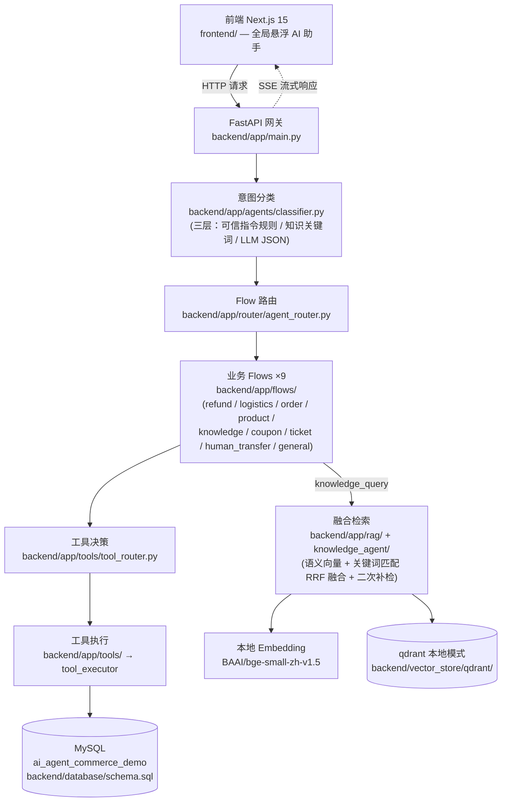

# E-commerce AI Customer Service Agent


电商 AI 客服 Agent 演示平台——在真实 MySQL 数据库之上提供多意图对话、RAG 知识问答与**可控写操作**（退款/投诉/转人工，AI 绝不静默写库）。前端 Next.js 全局悬浮助手 + 后端 FastAPI 决策链，全链路可评测、可审计。

## 在线演示

**[http://134.175.48.116:3000](http://134.175.48.116:3000)**（部署于腾讯轻量服务器 2C2G，slim 镜像 + API Embedding，详见 [DEPLOY.md](./DEPLOY.md)）｜演示账号：`13560569291` / `123456`

## 演示视频

[▶ 全流程演示（B 站，约 7 分钟）](https://www.bilibili.com/video/BV1jnHs6HEUt/)——覆盖：订单查询（页面上下文注入，免报单号）、物流追踪、**退款确认闸门**（AI 起草 → 用户卡片确认才落库）、口语化知识问答（RAG 检索 + 来源引用）、多 Agent 跨域协作（查物流 + 投诉防重复创建）、实时指标看板。

## 核心能力

<!-- 截图待补：界面截图放置于 docs/screenshots/，在此处插入 -->

- **多意图路由与多 Agent 协作**：三层意图分类（前端可信指令规则 → 知识关键词规则 → LLM JSON 兜底），9 个业务意图分发到 9 个业务 Flow
- **FSM 多轮对话与中断恢复**：退款申请、投诉创建等写操作走状态机多轮流程，中途切换话题可恢复现场
- **退款/投诉确认闸门**：AI 只能起草，必须用户显式确认才落库——绝不静默写数据库（配合三重查重防重复提交）
- **RAG 融合检索与口语查询理解**：语义向量 + 关键词匹配（payload 包含）RRF 融合、召回不足自动二次补检；口语化提问（"能用花呗付款不"）经词典快路径 + LLM 兜底两层理解
- **多来源信息整合**：跨订单/物流/商品/知识库多来源回答，带完整性契约与页面快照兜底，答案标注来源
- **SSE 流式输出**：基于 ContextVar 的零侵入流式设计，Flow 业务代码不感知流式细节
- **主动服务事件**：物流延误等事件主动推送提醒（dedup 去重、已读管理）
- **转人工真实排队**：转人工请求落库排队（`human_transfer_requests`），并读取人工坐席团队状态（`human_agent_status`）
- **全链路 Trace 与审计**：每次工具调用写入 `agent_audit_logs`（工具名/参数/结果/成功标记），实时指标看板可视
- **可评测的质量体系**：71 条路由评测用例 + 30 条 RAG 标注用例，见下方「评测与质量」

## 架构图



<details>
<summary>查看 Mermaid 源码</summary>



</details>

## 技术栈

| 层 | 技术 |
|---|---|
| 前端 | Next.js 15（App Router）+ React 19 + TypeScript + Tailwind CSS |
| 后端 | Python + FastAPI 0.115 + uvicorn（SSE 流式） |
| 数据库 | MySQL 8（`ai_agent_commerce_demo`） |
| 向量库 | qdrant 本地模式（嵌入式，无需独立服务） |
| Embedding | BAAI/bge-small-zh-v1.5（本地推理，512 维） |
| LLM | OpenAI 兼容接口（DeepSeek 等，可配置 base_url/model） |

## Quick Start

### 1. 环境要求

Python 3.10+、Node.js 18+、MySQL 8（本机 3306）。

### 2. 初始化数据库

```bash
mysql -u root -p -e "CREATE DATABASE ai_agent_commerce_demo DEFAULT CHARACTER SET utf8mb4;"
mysql -u root -p ai_agent_commerce_demo < backend/database/schema.sql
mysql -u root -p ai_agent_commerce_demo < backend/database/demo_minimal_cn.sql   # 中文演示数据
```

### 3. 配置后端环境

```bash
cd backend
cp .env.example .env
# 编辑 backend/.env：填入 OPENAI_API_KEY 与 OPENAI_BASE_URL / OPENAI_MODEL（LLM 接口）
```

### 4. 安装依赖并启动后端

```bash
python -m venv .venv
# Windows:
.venv/Scripts/python.exe -m pip install -r requirements.txt
.venv/Scripts/python.exe -m uvicorn app.main:app --host 0.0.0.0 --port 8000
# macOS / Linux:
# source .venv/bin/activate && pip install -r requirements.txt
# uvicorn app.main:app --host 0.0.0.0 --port 8000
```

> 注意：请始终使用项目 venv 的 Python。系统全局环境若缺依赖（如 qdrant_client）会直接 ModuleNotFoundError。

### 5. 启动前端

```bash
cd frontend
npm install
cp .env.local.example .env.local
# .env.local 默认 NEXT_PUBLIC_API_BASE_URL=http://localhost:8000，按需修改
npm run dev
```

### 6. 可选：知识库索引与演示数据

```bash
# 知识库重建（backend/knowledge_base/ 下的文档 → 切分 → 向量化入库）
cd backend && .venv/Scripts/python.exe rebuild_rag_index.py

# 演示业务数据重置（订单/物流/退款/投诉回到初始演示态）
cd backend && .venv/Scripts/python.exe scripts/reset_business_data.py
```

## 评测与质量

以下数字全部来自本仓库评测脚本的实际运行输出（运行日期：2026-09-23，Windows）：

| 指标 | 数值 | 复现命令（在 `backend/` 下，用 venv Python） |
|---|---|---|
| 后端单测 | **130 passed**, 3 warnings, 5.04s | `.venv/Scripts/python.exe -m pytest tests/ -q` |
| 路由评测 · 规则层合计 | **63/63 = 100.0%**（71 用例，离线模式 LLM 屏蔽，其中 8 条 LLM 层用例跳过） | `.venv/Scripts/python.exe -m evaluation.run_eval` |
| 路由评测 · 分项（intent[rule] / gate / confirm / deny / create / followup / coordinate） | 25/25、16/16、4/4、3/3、5/5、4/4、6/6，全部 100% | 同上 |
| RAG 评测 · top1 命中率 | **88.89%** | `.venv/Scripts/python.exe -m evaluation.run_rag_eval` |
| RAG 评测 · top3 命中率 | **100.00%** | 同上 |
| RAG 评测 · 平均 top1 分数 | 0.7044 | 同上 |
| RAG 评测 · 无答案过滤率 | **100.00%**（3 条无答案用例全部正确拒答） | 同上 |
| RAG 评测 · 通过条数 | 30/30（答案类 27 + 无答案 3） | 同上 |

说明：路由评测离线模式禁用 LLM、逼规则层独立作答，可入 CI 不依赖 API key；RAG 评测使用真实向量索引与规则查询理解，同样不需要 LLM API。RAG 评测报告写入 `backend/evaluation/rag_eval_report.json`（已 gitignore）。

## 技术亮点

**写操作确认闸门与三重查重。** 退款、投诉等写操作由 AI 起草参数，但必须经用户显式确认（confirm/deny 用例单独评测）才执行落库；闸门前做三重查重（同单同类型在途记录、会话内已确认记录、pending 确认卡），杜绝重复提交与 AI 自作主张写库。

**语义 + 关键词 RRF 融合检索与二次补检。** 语义向量召回口语变体，关键词路以 payload 包含匹配兜住型号/术语的精确字面命中，两路结果 RRF 融合排序；当召回覆盖度或相关性不足时触发二次补检（coverage/relevance 两种策略）。实测 30 条标注用例 top3 命中率 100%（见「评测与质量」）。

**口语查询理解双层设计。** 词典快路径先匹配常见口语改写（"花呗"→支付方式、"自提"→线下门店），毫秒级返回未命中再交给 LLM 兜底改写为标准查询，兼顾延迟与覆盖面；RAG 评测中的口语变体用例（如"能用花呗付款不""现在搞啥活动"）均正确命中知识文档。

**多来源信息整合。** 用户一个提问往往需要跨订单、物流、商品、知识库多个来源回答：完整性契约声明回答所需的最小信息集合，页面快照兜底提供用户当前所见上下文，最终答案逐条标注来源，不编造。

**ContextVar 零侵入 SSE 流式。** 流式写出能力通过 ContextVar 注入 Flow 执行上下文，9 个业务 Flow 的代码完全不为流式做任何特殊处理——新增 Flow 天然获得流式能力。

**审计与实时指标。** 每次工具调用落 `agent_audit_logs`（agent 名/工具名/参数/结果 JSON/成功标记/session 维度），配合指标看板接口实时呈现调用量、成功率、意图分布，问题可回溯到单次调用。

## 架构取舍

以下为如实的现状陈述，而非待办：

- **`app/workflow/` 是实验性编排引擎**，支持节点图编排与运行时记录，但**未接入生产聊天链路**；生产架构有意收敛为单一决策链（classifier → tool_router → flows → tools，见 `backend/app/architecture/production.py`），换取可预测的路由行为与更简单的调试路径。
- **legacy RAG 直连分支已通过开关禁用**，检索统一走 KnowledgeFlow 的融合检索链路，避免两套检索行为并存。
- **向量库为 qdrant 本地模式**：最初选型 ChromaDB 在 Windows 下存在原生绑定崩溃问题，回退到 qdrant 嵌入式模式（数据在 `backend/vector_store/qdrant/`，无需独立服务）。

## 项目结构

```
├── backend/
│   ├── app/
│   │   ├── main.py               # FastAPI 入口（SSE、事件、健康检查）
│   │   ├── agents/               # 意图分类、上下文事实解析
│   │   ├── flows/                # 9 个业务 Flow（多轮 FSM）
│   │   ├── tools/                # 工具层与路由（tool_router）
│   │   ├── rag/                  # 融合检索、切分、向量库
│   │   ├── architecture/         # 生产决策链装配（production.py）
│   │   └── workflow/             # 实验性编排引擎（未接入生产链路）
│   ├── database/                 # schema.sql + 中文演示数据
│   ├── knowledge_base/           # RAG 知识源文档
│   ├── evaluation/               # 路由评测与 RAG 评测脚本
│   ├── tests/                    # 130 个单测（含回归测试）
│   └── scripts/                  # 演示数据重置等运维脚本
├── frontend/
│   ├── app/                      # Next.js 15 App Router 页面
│   └── components/chat/          # 全局悬浮 AI 助手（SSE 流式渲染）
└── docs/                         # 截图等交付物
```

## 已知边界

演示级实现，如实列出：

- **鉴权为演示级**：请求 token 直接对应用户 user_id，无密码学与过期机制；
- **会话为进程内存储**：后端重启后会话状态丢失（业务数据在 MySQL 不受影响）；
- **单机部署假设**：MySQL、向量库（qdrant 本地模式）、会话状态均在单机，未考虑水平扩展。

## License

本项目基于 [MIT License](./LICENSE) 开源。
