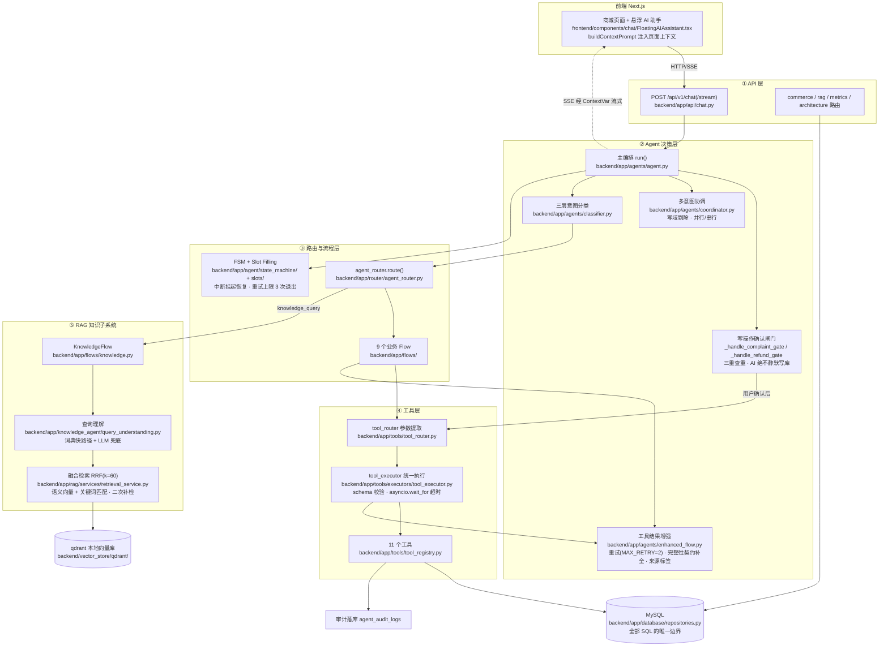

# 架构说明（ARCHITECTURE）

本文深入拆解本项目的分层架构、模块职责、核心业务流程与关键设计决策。项目定位、Quick Start 与评测指标见 [README](../README.md)，此处不再重复。

---

## 1. 总体架构

系统为五层结构，自上而下依次为：

**① API 层**（`backend/app/api/`）——五个路由模块（chat / commerce / rag / metrics / architecture）挂载于 FastAPI（`backend/app/main.py`）。聊天入口唯一：`/api/v1/chat` 及其 SSE 流式变体，由生产架构声明表（`backend/app/architecture/production.py`）声明为 canonical entry。前端与后端之间以统一响应信封 `BaseResponse` 交换数据。

**② Agent 决策层**（`backend/app/agents/`）——主编排器 `agent.py` 的 `run()` 是所有聊天消息的唯一入口，顺序处理：会话加载 → 待确认草稿短路 → Flow 恢复 → 多意图协调检测 → 意图分类 → 写操作确认闸门 → FSM/槽位 → Flow 执行 → Trace 构建。配套模块负责三层意图分类（classifier）、跨域协作（coordinator）、工具结果增强（enhanced_flow）与前端上下文解析（context_facts）。

**③ 路由与流程层**（`backend/app/router/` + `backend/app/flows/` + `backend/app/agent/`）——意图到 Flow 的查表调度（agent_router），9 个业务 Flow（refund / logistics / order / product / knowledge / coupon / ticket / human_transfer / general），以及多轮对话基座：状态机（FSM）、槽位填充（Slot Filling）、中断挂起与恢复、无效输入重试退出。

**④ 工具层**（`backend/app/tools/`）——11 个工具的注册与权限表（tool_registry）、参数提取与意图决策（tool_router）、统一执行入口（tool_executor：schema 校验 + 超时控制 + 结果结构化）。所有工具读写真实 MySQL，写操作成功后安全落主动事件，查询工具写审计日志。

**⑤ RAG 知识子系统**（`backend/app/knowledge_agent/` + `backend/app/rag/`）——独立的知识问答链路：查询理解（口语改写）→ 语义+关键词融合检索（RRF）→ 类别过滤与二次补检 → 父块组装 → 受限生成。向量库为 qdrant 本地模式。

## 2. 核心模块职责

| 模块路径 | 职责 | 关键类 / 函数 |
|---|---|---|
| `backend/app/agents/agent.py` | 聊天主编排（唯一入口）：分支调度、确认闸门、Trace 构建 | `Agent.run()`、`_handle_complaint_gate()`、`_handle_refund_gate()` |
| `backend/app/agents/classifier.py` | 三层意图分类：前端可信指令规则 → 知识关键词规则 → LLM JSON 兜底 | `_classify_business_intent_by_rule()`、`_classify_knowledge_intent_by_rule()` |
| `backend/app/agents/coordinator.py` | 多意图协作：≥2 域触发，写域依赖剔除，无依赖并行/有依赖串行 | `should_coordinate()`、`GATED_WRITE_DOMAINS` |
| `backend/app/agents/enhanced_flow.py` | 工具执行增强：重试、降级映射、完整性契约补全、来源标签 | `MAX_RETRY=2`、`TOOL_RESULT_CONTRACTS` |
| `backend/app/agents/context_facts.py` | 解析前端注入的系统上下文为结构化事实（仅进 LLM 上下文，不落日志） | 按行前缀解析订单/商品/物流/退款/投诉事实 |
| `backend/app/agents/complaint_intent.py` | 确认/否认/显式创建/跟进判定与投诉编号提取 | 投诉闸门与只读跟进 Flow 的判定基础 |
| `backend/app/agent/memory/session.py` | 内存会话（TTL 1800s）：当前 Flow、槽位、挂起栈、待确认草稿 | `Session`、`SESSION_TTL=1800` |
| `backend/app/agent/state_machine/` | 纯逻辑 FSM（无 LLM 无副作用）：退款/物流槽位状态机 | `RefundFSM`、`LogisticsFSM`、`init_fsm()` |
| `backend/app/agent/slots/slot_manager.py` | FSM 与 Session 的协调，产出槽位填充结果 | `SlotFillingResult(ready/prompt/waiting_for)` |
| `backend/app/agent/interrupt/interrupt_manager.py` | FSM 等待态的意图抢占：挂起当前 Flow、关键词恢复 | `RESUME_KEYWORDS` |
| `backend/app/agent/recovery/recovery_manager.py` | 连续无效输入处理：3 次后澄清或退出 Flow | `MAX_RETRY_COUNT=3` |
| `backend/app/router/agent_router.py` | 意图 → Flow 查表调度；低置信度降级 GeneralFlow | `route()`、`CONFIDENCE_HIGH` |
| `backend/app/tools/tool_registry.py` | 11 个工具注册、intent→tool 映射、Agent→Tool 权限表 | `AGENT_TOOL_PERMISSIONS`、`init_tools()` |
| `backend/app/tools/tool_router.py` | 按意图选工具；订单号等参数提取（多优先级正则） | `select_tool()`、`select_tools_for_workflow()` |
| `backend/app/tools/executors/tool_executor.py` | 统一执行：schema 校验 → 超时控制 → 结果结构化（延迟/超时标记/Trace 字典） | `asyncio.wait_for` |
| `backend/app/knowledge_agent/` | 知识问答独立 Agent：工作流编排、查询理解、文档管理 | `KnowledgeWorkflow`、`KnowledgeAgent`、`query_understanding.py` |
| `backend/app/rag/services/retrieval_service.py` | 融合检索：语义向量 + 关键词匹配（payload 包含），RRF(k=60) 融合排序 | `query_knowledge_fused()`、`_rrf_fuse()` |
| `backend/app/rag/chunkers/parent_child_chunker.py` | 父子块切分：父块 800/150 用于返回，子块 250/50 用于检索 | `PARENT_CHUNK_SIZE=800` |
| `backend/app/rag/vectorstore/chroma_store.py` | qdrant 本地模式向量存取（文件名沿用历史，见 §4） | uuid5 确定性 ID 保证入库幂等 |
| `backend/app/rag/vectorstore/embedding_provider.py` | Embedding 工厂：本地 BGE 或 OpenAI 兼容 API，支持测试注入 | `embedding_provider` 工厂 |
| `backend/app/database/repositories.py` | 全部 SQL 的唯一边界（工具层不写 SQL） | 各业务表 Repository |
| `backend/app/services/llm.py` | 唯一 LLM 通道（OpenAI 兼容）；SSE 经 ContextVar 流式写出 | `call_llm()` |
| `backend/app/services/proactive.py` | 主动事件安全封装（吞异常不拖累主流程） | `emit_proactive_event()` |
| `backend/app/api/`（5 模块） | chat（聊天/SSE）、commerce（电商业务）、rag（知识库管理）、metrics（实时看板）、architecture（架构声明只读） | 各路由模块 |
| `frontend/components/chat/FloatingAIAssistant.tsx` | 全局悬浮助手：上下文注入、SSE 渲染、确认卡片、Trace 面板 | `buildContextPrompt()`、`detectCapability()` |
| `frontend/components/debug/DebugPanel.tsx` | Agent Trace 可视化（含 RAG 检索透明化） | `AgentTraceData` 渲染 |

## 3. 核心业务流程

### 3.1 聊天主流程（含确认闸门短路）

1. 前端组装消息：用户输入 + `[系统补充上下文]` 段（页面快照、可信任务指令、订单/退款/投诉列表）→ POST `/api/v1/chat/stream`。
2. `agent.run()` 加载 Session；**待确认草稿短路**——存在 pending 投诉/退款草稿且本轮输入是确认/取消/等原因时，直达对应闸门，不再走分类路由；无关话题则丢弃过期草稿恢复正常路由。
3. 依次检测：Flow 恢复关键词（挂起栈 + "继续"）→ FSM 进行中的中断检测与会话恢复 → 多意图协调检测。
4. 正常分支：三层分类 → 写操作意图（ticket / refund）进确认闸门——AI 起草参数返回 `pending_*` 卡片，**必须等用户显式确认**；确认后执行三重查重（草稿收集后 / 首轮 / 建单前安全网）才调用写工具。
5. `logistics_query` / `refund` 意图注册 FSM 收集 order_id：不足则 LLM 人格化追问；支持中断挂起与恢复；连续 3 次无效输入退出 Flow。
6. Flow 执行：`tool_router` 提参 → `tool_executor`（超时控制）→ `enhanced_flow`（重试 / 完整性契约补全 / 页面快照兜底 / 来源标签）→ 工具真实数据注入 prompt → `call_llm` 综合回答，SSE 下逐 token 推送。
7. 全程构建 AgentTrace 并落盘；查询工具写 `agent_audit_logs`；metadata 携带确认卡片与 RAG 来源，前端渲染。

### 3.2 知识问答流程

1. 规则层直接命中 `knowledge_query` → KnowledgeFlow 剥离系统上下文，提取 `[用户请求]` 后的真实问题。
2. 指代消解（`rag/services/context_builder`，利用会话历史）→ 查询理解：口语词典快路径（置信度 ≥0.6 直接命中）否则 LLM 改写为正式检索 query + 分类。
3. 融合检索：语义向量（`RETRIEVAL_MIN_SCORE` 阈值过滤）+ 关键词匹配（payload 包含）两路召回，RRF(k=60) 融合排序。
4. 类别过滤（显式/LLM/关键词三路并集，防硬过滤误删）→ 两道校验补检：语义无命中用扩展查询重检一次；top-5 缺关键实体用窄查询重检一次。
5. 规则重排（原子知识卡/商品型号加权）→ 父块组装（检索命中的是子块，返回给 LLM 的是父块完整上下文）→ 受限生成（只基于检索上下文，无命中则如实声明，不编造）→ 返回引用。

### 3.3 多意图协作流程

1. `coordinator.should_coordinate()`：≥2 个领域正则命中才触发；退款/投诉写域做依赖剔除（"退款+订单查询"不进协作，改走单意图闸门）。
2. 无依赖域并行执行（订单/物流走 enhanced_flow 增强查询）；有依赖域串行。
3. 退款/投诉域在协作中**只读播报已有记录或引导走确认流程**，绝不静默写库。
4. 各域结果 + 前端页面快照交给 LLM 综合为一次回答；若用户明确要创建投诉且内容充分，落 pending 草稿，下一轮"确认"直达闸门。

### 3.4 主动服务事件流程

1. 写操作（退款/投诉/工单/转人工）成功 → 工具内 `emit_proactive_event` 安全落事件（异常吞掉不拖累主流程）。
2. 前端轮询 `/api/commerce/agent/events` → 后端扫描订单/物流/退款/投诉状态生成洞察事件，`dedup_key` 唯一约束去重，只返回未读。
3. 用户点"立即处理" → action_prompt 直接作为聊天消息发给 AI → 走正常聊天链路处理。

## 4. 关键设计决策

**写操作确认闸门与三重查重。** 本项目的安全红线是"AI 绝不静默写库"：投诉/退款由 AI 起草、用户卡片确认后才执行。确认后仍做三重查重（草稿收集后、首轮、建单前安全网）防重复提交；页面直提的 `POST /api/commerce/refunds` 不走闸门——闸门只约束 AI 链路，人类操作不受限。TicketFlow 本身设计为只读（跟进 + 指引），无写库路径。

**`app/workflow/` 实验性编排引擎未接入生产链路。** 引擎（AgentGraph / SupervisorAgent / Checkpoint / Branch / Governance / Handoff 等，约 25 个文件）已建成并在启动时初始化，但生产聊天链路有意收敛为单一决策链（`backend/app/architecture/production.py` 声明表记录了入口与各层映射）。取舍理由：单一链路的路由行为可预测、调试路径简单；引擎仅 `decision_tracer` 被知识链路借用落 Trace JSON。改动聊天行为时应改决策链，而非该引擎。

**legacy RAG 直连分支已禁用。** `agent.py` 中直连 `rag_answer` 的旧分支保留但由硬编码开关 `production_disable_legacy_rag = True` 关闭，保证检索行为统一走 KnowledgeFlow 的融合检索链路，避免两套检索语义并存。

**向量库从 ChromaDB 回退到 qdrant 本地模式。** ChromaDB 的 Rust 绑定在 Windows 下崩溃，回退为 qdrant-client 本地模式（纯 Python 嵌入式，数据在 `backend/vector_store/qdrant/`，无需独立服务）。历史包袱：存储模块文件名仍为 `chroma_store.py`，内部实现已是 qdrant。

**ContextVar 实现的零侵入 SSE 流式。** 流式写出能力通过 ContextVar 注入（`backend/app/services/llm.py`），9 个业务 Flow 的代码不为流式做任何特殊处理，新增 Flow 天然获得流式能力；SSE 端点帧协议为 `start → delta* → done`。

## 5. 数据与状态

**MySQL（库 `ai_agent_commerce_demo`，建表 `backend/database/schema.sql`）关键表：**

| 表 | 用途 |
|---|---|
| `orders` / `order_items` | 订单与明细 |
| `refunds` | 退款记录（AI 链路经闸门写入，页面可直提） |
| `complaints`（+process_records/escalations） | 投诉及处理过程 |
| `human_transfer_requests` + `human_agent_status` | 转人工真实排队与客服状态机 |
| `proactive_events` | 主动服务事件（dedup_key 唯一、已读/未读） |
| `agent_audit_logs` | 每次工具调用审计（agent/工具/参数/结果/成功标记/session） |
| `workflow_runtime_records` | workflow 引擎运行时记录 |

**内存状态**：会话 Session 存进程内 dict（`SESSION_TTL=1800` 秒，即 30 分钟），含当前 Flow、槽位、挂起栈、待确认草稿；后端重启即失（业务数据在 MySQL 不受影响）。

**向量索引**：`backend/vector_store/qdrant/`（collection `knowledge`，cosine，512 维；运行时产物，已 gitignore，可由 `backend/rebuild_rag_index.py` 全量重建）。

## 6. 已知技术债与边界

以下为当前状态的如实陈述（非待办清单），供评估工程成熟度：

- **演示级鉴权**：登录密码 SHA-256 无盐，token 即 user_id 明文，commerce API 无鉴权中间件（凭 user_id 可查任意用户数据）。影响：不可用于任何真实生产环境，仅限本地演示。
- **会话为进程内存储**：Session（含待确认草稿、挂起栈）存内存 dict。影响：后端重启丢失会话状态；多 worker 部署下会话不共享；水平扩展前需迁移到 Redis 等外部存储。
- **前后端魔法文本协议**：`[系统补充上下文]`、`[用户请求]`、`本轮任务：xx` 等字符串是隐式契约，贯穿前端拼接与后端多处 split 解析（classifier / tool_router / context_facts / knowledge flow 等）。影响：措辞改动会静默破坏路由与闸门，历史上多次引发修复；触碰相关代码需同步核对全部解析点。
- **规则关键词多层分布**：classifier、tool_router、query_understanding、前端 detectCapability 各自维护关键词表（部分已收敛为单一事实源）。影响：长期存在漂移风险，新增关键词需多点同步。
- **状态值中英文混用**：schema 默认值英文（'active'）与运行数据中文（'正常'）并存，metrics 靠硬编码集合映射两套值。影响：看板统计对状态值变更脆弱。
- **主编排器体量大**：`agents/agent.py` 约 1900 行，闸门/协调/恢复多分支并存。影响：主链路改动漏改分支的风险较高，回归依赖测试套件覆盖。
- **测试依赖本机 MySQL**：单测套件需要可用的 MySQL 实例。影响：CI 化需先做数据库解耦（容器化或 testcontainers）。
- **单机部署假设**：MySQL、qdrant 本地库、内存会话均在单机。影响：不适用于分布式部署场景。
