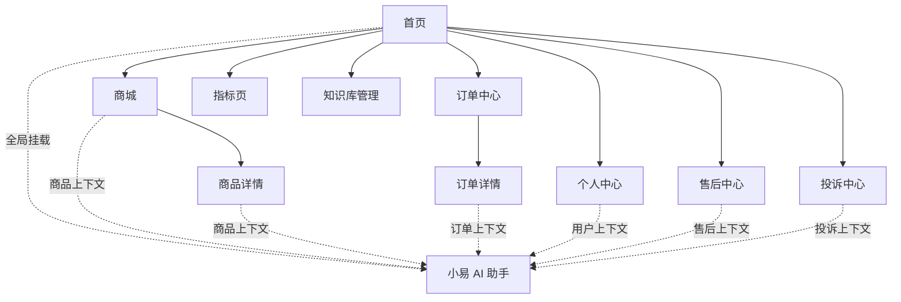
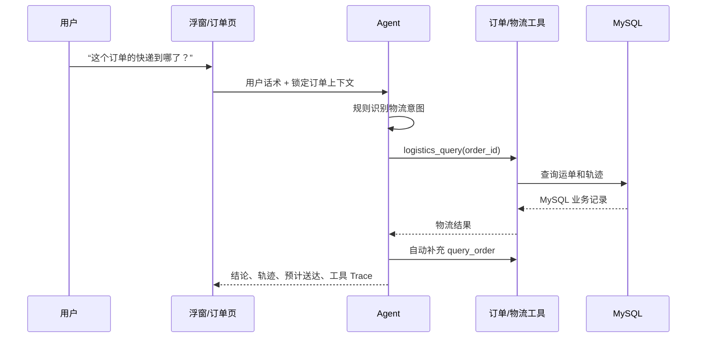

# 小易 AI 电商助手 - 产品开发文档

> 文档版本：基于当前已实现项目梳理，2026-07-18  
> 产品名称：小易电商助手  
> 产品定位：连接电商业务系统与用户自然语言需求的任务执行型 AI 购物/客服助手  
> 文档性质：现状 PRD + 可验收的产品方案；当前实现、未完成项和后续需求明确区分。  
> 工程实现见 `项目开发文档.md`；环境、账号、场景脚本和展示话术见 `项目演示文档.md`。

## 1. 产品定义

小易不是传统“问答客服”，而是嵌入电商前台的 AI 服务入口：用户在逛商品、看订单、处理售后时，可以直接说出需求，助手自动读取页面和用户业务上下文，查询真实业务记录，并在受控条件下完成退款申请、投诉建单和人工排队等动作。

产品想完成的升级是：

```text
传统客服：用户提问 -> 客服解释操作路径 -> 用户自己找页面完成

小易助手：用户说需求 -> 自动理解上下文 -> 查询/执行业务动作 -> 返回结论与下一步
```

### 1.1 一句话价值主张

边逛边问，把“查、问、办、跟进”整合到一个有上下文、有执行力、可追溯的电商 AI 助手里。

### 1.2 产品边界

当前产品是本地原型/验证环境，不是面向真实消费者的生产商城。它重点验证以下产品假设：

- 电商业务数据接入，而非纯模拟聊天；
- Agent 能够路由、收集信息、调用工具和完成受控写操作；
- 高风险写操作有明确确认和重复单保护；
- 主动服务、个性化推荐、知识库问答、人工协同及可观测性可以形成闭环。

### 1.3 产品战略与核心假设

#### 产品愿景

让消费者在电商旅程中的任何节点都能用一句话完成“查清楚、办成事、有人接”，并让每一次 AI 执行都可解释、可确认、可追溯。

#### 优先战略场景

| 优先级 | 场景 | 选择理由 | 当前验证状态 |
| --- | --- | --- | --- |
| S0 | 订单/物流查询 | 高频、事实明确、适合工具化，能快速验证上下文价值 | 已实现，自动化路由与工具测试覆盖 |
| S0 | 退款申请/进度 | 高频且涉及资金权益，能验证确认闸门和幂等 | 已实现；退款确认端到端自动化仍缺 |
| S0 | 投诉创建/跟进 | 高情绪、高风险，能验证只读/写入区分和人工升级 | 已实现；投诉相关路由/确认测试覆盖 |
| S1 | 规则/商品知识问答 | 能验证 RAG 与实时业务数据分层 | 已实现；黄金集尚未自动评测 |
| S1 | 人工转接与主动提醒 | 验证 AI 与人工协同、风险预防 | 当前为队列原型和轮询扫描 |
| S2 | 个性化推荐、优惠券 | 增强导购价值，但不应先于安全与服务闭环 | 已实现/部分实现 |

#### 待验证假设

| 假设 | 验证方式 | 成功信号 | 当前状态 |
| --- | --- | --- | --- |
| 页面上下文能减少重复报单 | 对比有/无上下文的任务测试 | 平均补充轮次、订单号重复输入下降 | 代码已实现，尚无真实用户样本 |
| 确认卡不会显著降低高风险任务完成率 | 观察草稿展示到确认的漏斗 | 确认率与错误写入率同时达标 | 机制已实现，缺线上基线 |
| 规则优先 + LLM 兜底能降低误路由 | 版本化意图黄金集 | 关键 Intent/Flow/Tool 准确率达到门槛 | 部分单测，缺统一评测 |
| 主动洞察比被动问答更早发现问题 | 对异常订单任务做可用性测试 | 事件打开率和处理率高于被动组 | 当前依赖前端轮询，未做实验 |
| RAG 来源展示能提升信任 | 规则问答可用性测试 | 引用查看率、无依据追问率改善 | Trace 有来源，未做用户实验 |

#### 北极星与反指标

当前原型不应伪造线上收益，因此只定义生产化后的目标口径，不把本地样本当基线。

- **北极星指标（NSM）**：在身份、资源归属和确认校验通过的前提下，AI 独立完成且用户未在 24 小时内纠正/重复提交的有效服务任务数。
- **效率指标**：有效任务闭环率、首次解决率（FCR）、平均对话轮数、从首问到完成的 P50/P95 时长、转人工率。
- **信任指标**：错误写入率、重复退款/投诉率、用户取消率、用户纠正率、RAG 无依据回答率、敏感数据泄露事件数。
- **成本指标**：LLM 请求量、Token/任务、工具失败重试次数、每个有效任务的模型与基础设施成本。
- **反指标**：未经确认写入、跨用户读取、重复建单、用户因 AI 误导而再次人工描述、超时后重放造成的多次写入。

每个指标都必须登记分母、事件来源、时间窗口、用户分群、Owner 和告警阈值；当前 `/api/metrics` 只提供部分业务 COUNT、审计和 Flow 聚合，不能替代完整指标平台。

## 2. 问题背景

项目原始需求分析归纳了传统电商客服的八类问题，当前产品均有对应设计。

| 用户/业务痛点 | 传统体验 | 小易的当前解法 | 已实现证据 |
| --- | --- | --- | --- |
| 重复描述问题 | 客服反复索要订单号、商品、物流信息 | 自动携带当前用户、页面、商品、订单、售后快照 | 商品/订单页 `AgentEntry`、浮窗上下文装配 |
| 找不到业务入口 | 在菜单、帮助中心、客服间跳转 | 自然语言统一入口 + 场景快捷卡 | 全局浮窗 8 个快捷场景、页面按钮 |
| 客服只能解释不能执行 | “请到售后页操作” | 工具调用查询和执行退款、投诉、人工排队 | MySQL Repository 与 Tool 层 |
| 不知道怎么提问 | 空白聊天框、能力不透明 | 访客建议、登录后场景卡、服务概览、订单选择 | 浮窗欢迎态/场景态 |
| 上下文不连续 | 多轮重复解释 | 前端 session ID + 后端 Session、FSM、挂起恢复 | `session.py`、中断/恢复模块 |
| 服务被动 | 物流异常、退款卡住后用户才发现 | 洞察扫描、去重事件、未读提醒 | `agent_insights`、`proactive_events` |
| 缺乏个性化 | 所有人得到同一推荐 | 按真实购买品类/品牌选未购买且有货商品 | `recommend_products` 工具 |
| 解决链路长 | 查订单、售后、人工分散 | 从上下文查询到执行动作统一在对话入口 | Flow + Tool + 确认卡 |

## 3. 目标、非目标与衡量方式

### 3.1 当前版本目标

1. 证明 AI 可以安全接入电商业务而不止是生成话术。
2. 降低订单、物流、退款、投诉场景中的信息补充和页面跳转成本。
3. 将写操作从“模型自行决定”改为“信息完整 + 用户确认 + 可追溯”的服务流程。
4. 展示产品经理视角下 AI 应用的完整闭环：用户体验、业务规则、数据、执行、主动服务、可观测性。

### 3.2 当前非目标

- 不是完整支付、电商交易或仓配系统；下单仅创建本地订单及初始物流记录。
- 不是多租户 SaaS、真实客服坐席平台或生产级权限系统。
- 不承诺真实物流追踪、真实退款到账或真实人工坐席分配；这些由本地 MySQL 业务记录和队列原型表达。
- 不提供真正的实时消息推送；主动提醒当前由前端轮询触发扫描。
- 不把所有知识或每个 Agent 都交由 LangGraph 执行；生产聊天主链路以 Flow/FSM/Tool 为准。

### 3.3 指标框架

| 指标层 | 当前可观测指标 | 数据源 | 说明 |
| --- | --- | --- | --- |
| 业务规模 | 订单、退款、投诉、商品、用户总量 | MySQL 业务表 | `/api/metrics` 实时聚合 |
| Agent 使用 | 工具调用总数、独立会话数、Agent/Flow 分布 | `agent_audit_logs` | 只统计有审计记录的工具调用 |
| 工具质量 | 工具整体和逐工具成功率 | `agent_audit_logs.success` | 日志为空时前端会显示估算条，不可当真实指标 |
| 服务风险 | 异常物流、待处理退款、未结投诉数量 | 洞察计算 | 按当前业务状态实时计算 |
| 主动服务 | 未读事件数、已读状态 | `proactive_events` | 使用用户+洞察键去重 |
| 体验效率 | 当前尚未采集 | 建议后续埋点 | 首次解决率、平均轮次、放弃率、转人工率、确认转化率 |

当前可观测指标与生产目标指标必须分开标记：本地业务 COUNT、审计日志和样本/估算展示只能说明实现存在，不能推导线上用户价值或模型质量。

### 3.4 指标事件与口径草案

后续埋点应以一次用户任务为主键，至少包含 `trace_id`、`session_id`、`user_id`（脱敏）、Intent、Flow、工具、业务对象、风险级别、结果和时间戳；同时记录模型/provider、Prompt 版本、知识索引 checksum、实验分组、Token usage/cost 与输入输出脱敏策略。建议事件如下：

| 事件 | 触发时机 | 关键属性 | 可支持指标 |
| --- | --- | --- | --- |
| `assistant_opened` | 浮窗打开 | 登录态、页面、来源 | 渗透率、入口转化 |
| `task_started` | 用户发送首条任务话术/点击快捷场景 | Intent 初判、上下文来源 | 任务量、场景分布 |
| `slot_requested` / `slot_filled` | FSM 追问/成功收集 | Slot 名、重试次数 | 补充轮次、槽位成功率 |
| `tool_called` / `tool_completed` | 工具开始/结束 | 工具、延迟、成功、错误码 | 工具成功率、P95 延迟 |
| `confirmation_shown` / `confirmation_decided` | 展示/确认/取消高风险草稿 | 订单、金额摘要、动作、结果 | 确认转化、取消率、错误写入 |
| `task_completed` / `task_abandoned` | 业务动作完成/会话结束 | 完成类型、轮次、总耗时 | NSM、FCR、放弃率 |
| `human_transfer_requested` | 创建人工排队请求 | 队列、等待时间 | 转人工率、等待 P95 |
| `rag_retrieved` / `rag_answered` / `rag_feedback` | 检索、回答、反馈 | query、文档、引用、是否无答案 | Recall、引用质量、无答案率 |
| `proactive_event_viewed` / `proactive_event_handled` | 主动事件展示/处理 | 事件类型、优先级、结果 | 事件处理率、复发率 |

当前代码只持久化部分审计、业务和主动事件字段；前端消息点赞/点踩为组件本地状态，尚未形成上述完整事件链。

### 3.5 核心指标口径

| 指标 | 分子 | 分母 | 排除项 |
| --- | --- | --- | --- |
| 有效任务闭环率 | 在规定窗口内完成且无纠正/重复提交的任务数 | 已开始且身份/对象合法的任务数 | 纯闲聊、测试流量、系统健康检查 |
| 首次解决率（FCR） | 首轮或规定轮次内完成、未转人工且 24 小时内未重问的任务数 | 可由 AI 处理的有效任务数 | 主动事件未进入任务、用户主动取消 |
| 确认转化率 | 用户明确确认并成功写入的草稿数 | 展示确认卡的草稿数 | 工具不可用导致的系统失败应单独分层 |
| 写操作安全率 | 未确认写入为 0 且重复/并发请求 exactly-once 的任务数 | 所有高风险写任务数 | 任何 P0 安全事件都按 0 处理，不用平均值稀释 |
| RAG 引用准确率 | 引用能支持答案关键断言的回答数 | 产生引用的回答数 | 无相关问题应单独统计 abstain |
| 主动事件处理率 | 用户查看后完成关联动作的事件数 | 展示给用户的可处理事件数 | 已过期、系统重复事件 |

所有指标必须按用户类型、场景、模型版本、Prompt/知识版本和时间窗分层；没有分母、排除规则和事件版本的数字不进入产品看板。

### 3.6 用户研究与实验计划

当前没有真实线上基线，因此先用可控的任务测试建立基线，再决定是否进入小流量实验。研究结果必须记录样本、任务脚本、版本、失败原因和原始证据，不用单次成功演示代替用户验证。

| 研究问题 | 方法 | 样本/分组 | 主要指标 | 决策规则 |
| --- | --- | --- | --- | --- |
| 页面上下文是否减少重复输入 | 有上下文/无上下文任务对照 | 12-20 名消费者，随机交叉 | 完成率、补充轮次、耗时、错误订单号率 | 完成率不下降且轮次/耗时改善才扩大范围 |
| 确认卡是否建立信任 | 现有确认卡与不同文案/摘要密度可用性测试 | 有退款/投诉经历用户优先 | 确认率、取消原因、错误提交、理解正确率 | 错误提交必须为 0；理解错误则不发布 |
| RAG 引用是否减少追问 | 显示来源/不显示来源对照 | 规则问题黄金集 + 用户任务 | 正确率、重问率、引用查看、信任评分 | 正确率不下降且重问率改善才保留交互 |
| 主动提醒是否带来提前处理 | 轮询提醒/无提醒任务对照 | 有异常订单的测试账户 | 事件查看率、处理率、重复咨询率 | 处理率提升且打扰/关闭率可接受才接入通知 |
| 人工交接是否减少重复描述 | 结构化摘要/空摘要对照 | 坐席或客服模拟任务 | 交接耗时、重复提问率、处理正确率 | 摘要缺字段或越权时直接阻断 |

研究前置问卷应收集登录、售后、隐私和可访问性需求；研究数据脱敏并与业务库隔离。当前原型只能做内部任务测试，不能据此宣称用户满意度、节省人力或复购提升。

## 4. 用户与使用场景

### 4.1 用户角色

| 用户 | 目标 | 当前产品入口 |
| --- | --- | --- |
| 访客 | 了解商品、活动、规则、服务能力 | 首页、商城、未登录 AI 浮窗 |
| 登录消费者 | 查订单、追物流、查看权益、购买和售后 | 个人中心、订单、售后、全局 AI 浮窗 |
| 有售后问题的消费者 | 提交退款、投诉、查询处理进度、转人工 | 订单详情、售后/投诉页、AI 确认卡 |
| 有购买历史的消费者 | 获得解释性商品推荐 | AI “推荐”场景/自然语言提问 |
| 内部运营/开发者 | 查看工具、流程、审计、业务数据 | 指标页、Agent 面板、Trace API |
| 知识库维护者 | 上传/同步规则、SOP、商品文档 | 知识库管理页与 `/api/rag/sync` |

### 4.2 典型任务

| 任务 | 用户话术/操作 | 产品处理 | 输出 |
| --- | --- | --- | --- |
| 查物流 | “这个订单快递到哪了？” | 锁定订单 -> Logistics Flow -> 查物流并补订单信息 | 当前位置、状态、预计送达、轨迹 |
| 申请退款 | “这件商品质量有问题，我要退款” | 提取订单和原因 -> 显示确认卡 -> 用户确认后写退款 | 退款单、审核中状态、后续预期 |
| 跟进退款 | “退款多久到账/进度怎样” | 已有退款则读取真实状态；规则问题走知识库 | 当前业务进度或政策说明 |
| 创建投诉 | “商品坏了，我要投诉” | 判断为明确创建 -> 补原因 -> 确认卡 -> 写工单 | 投诉/工单编号、处理提示 |
| 跟进投诉 | “我投诉过了，想看进展” | 只读查询投诉或按订单查最近投诉 | 当前状态、优先级、升级/下一步 |
| 商品推荐 | “根据我买过的东西推荐几款” | 读取购买记录、排除已购、选择有货商品 | 有理由的推荐列表 |
| 问规则 | “七天无理由退货条件是什么？” | Knowledge Agent 检索并受上下文约束回答 | 简短规则说明与 Trace 来源 |
| 转人工 | “帮我找人工客服” | 读取队列并创建排队请求 | 排队位置、预计等待 |

### 4.3 Persona 与 JTBD

| Persona | 优先级 | 触发与频次 | Job To Be Done | 成功标准 | 关键诉求 |
| --- | --- | --- | --- | --- | --- |
| 普通登录消费者 | P0 | 查订单/物流，数次/单 | 当我想知道订单进展时，希望不重复输入订单号就得到可信状态 | 1-2 轮内得到正确状态，能继续处理 | 快、少填、信息可信 |
| 售后消费者 | P0 | 退款/投诉，低频但高风险 | 当商品有问题时，希望清晰知道权益并安全发起处理 | 信息完整、确认前可修改、结果可追踪 | 金额/原因透明、不能误提交 |
| 情绪化或复杂问题用户 | P0 | 异常物流、投诉升级 | 当自助路径无法解决时，希望快速交给人工且不重复描述 | 交接摘要完整、队列信息真实、失败有出口 | 被理解、可升级、可回溯 |
| 访客/潜客 | P1 | 商品/政策咨询 | 当我还未登录时，希望先获得可信商品与规则答案 | 不泄露个人数据，答案有来源/边界 | 低门槛、可继续购物 |
| 知识运营人员 | P1 | 文档更新、规则变更 | 当政策变化时，希望可控地更新知识并验证影响 | 可追踪来源、类别、索引状态和回滚 | 版本、审核、质量报告 |
| 客服坐席/主管 | P1 | 接收升级任务 | 当 AI 无法闭环时，希望拿到结构化上下文和已执行动作 | 不重复询问，能继续处理和回写结果 | 摘要、SLA、权限 |
| 平台安全/法务 | P0 | 生产上线前及持续审计 | 当 AI 访问业务数据时，希望每次读取/写入可授权、可审计 | 无越权、敏感数据最小化、可追责 | 身份、授权、脱敏、留存 |

### 4.4 用户旅程与服务蓝图

| 阶段 | 用户行为/情绪 | 前台体验 | Agent/后台动作 | 失败出口与指标 |
| --- | --- | --- | --- | --- |
| 售前咨询 | 浏览、比较，想快速确认参数 | 商品页唤起助手，回答带商品上下文 | `product_query`/`knowledge_query`，查询商品或 RAG | 无答案明确说明并转人工；答案采纳率、重问率 |
| 下单后查进展 | 焦虑，想知道包裹在哪 | 订单页直接咨询，展示状态和轨迹 | `order_query`/`logistics_query`，MySQL 查询并补充关联数据 | 订单缺失/归属失败拒绝；首答成功率、查询时长 |
| 物流异常 | 担心延误，可能情绪升级 | 主动事件提醒 + 一键处理 | 洞察扫描、`dedup_key` 去重，必要时转人工 | 工具不可用时给页面/人工出口；事件处理率、转人工率 |
| 退款申请 | 高风险，担心钱和权益 | 收集原因，展示订单/商品/金额确认卡 | Refund FSM -> `refund_apply`，确认后在单连接事务内写入退款记录并同步订单状态 | 取消不写、重复不增；确认率、错误写入率、P95 |
| 投诉与升级 | 不满，希望被重视 | 区分查询与新建，显示处理状态/升级信息 | 只读跟进或投诉确认闸门 + TicketFlow，确认后写主记录和首条处理记录 | 重复投诉拦截，队列不可用转人工/页面；重复建单率 |
| 人工交接 | AI 不足但不想重复描述 | 展示队列位置、等待和交接摘要 | 写 `human_transfer_requests`，携带已执行工具/待处理动作 | 队列失败保留摘要并给联系方式；等待 P95、转接后重复描述率 |

当前原型的“主动事件”由用户打开助手或前端轮询触发，不是后台事件总线；Session 与确认草稿也未跨进程持久化（事件已读已落库）。上述旅程是产品目标与当前实现的对照基线。

## 5. 产品信息架构



### 5.1 页面职责

- 首页：抖音商城风格的频道、商品推荐、业务数据卡和 AI 导购入口。
- 商城：关键词搜索、类目筛选、库存和商品状态展示、商品级 AI 咨询。
- 商品详情：规格、库存、数量选择、下单、带商品 ID 的咨询。
- 订单/订单详情：状态、明细、物流轨迹、订单级 AI 咨询、直接退款入口。
- 售后中心：退款申请、退款记录、状态可视化。
- 投诉中心：投诉提交、状态、优先级、升级展示。
- 个人中心：账户、地址、最近订单、用户级咨询。
- 指标页：业务、调用、Flow、Prompt 迭代及设计决策可视化。
- 知识库：上传、解析、切片结果展示。

## 6. 核心产品方案

### 6.1 交互原则

1. 上下文优先：用户已在订单页、商品页或选择订单后，不重复索要已有信息。
2. 结论优先：先给用户当前结果和下一步，再补必要细节。
3. 写操作可确认：退款、投诉要让用户看到待提交内容，用户确认后再写库。
4. 数据可信：订单号、金额、状态、物流和工单信息必须来自工具/数据库，缺失时明确说明未查到。
5. 复杂度渐进披露：消费者看到自然语言、卡片和操作；开发调试时可展开 Trace 查看意图、Flow、工具和耗时。
6. 失败有出口：字段缺失时引导补充；重复单直接告知；工具失败时给出重试、页面入口或转人工建议。

### 6.2 AI 浮窗体验

全局浮窗是产品核心入口，分为三种状态。

| 状态 | 用户可见内容 | 实现细节 |
| --- | --- | --- |
| 未登录欢迎态 | 数字人介绍、注册/登录、轮换推荐问题 | 只回答通用商品、政策、知识库问题；涉及真实订单引导登录 |
| 登录未对话态 | 服务概览、异常洞察、未读提醒、8 个场景卡、订单选择器 | 拉取订单/退款/投诉快照、insights、events |
| 对话进行态 | 消息、SSE 真流式逐字输出、Flow/工具芯片、数据卡、确认卡、反馈 | 后端 `trace` 附在该轮 AI 消息 metadata |

展开后，登录用户可以在“对话”和“Agent 面板”之间切换；后者展示意图、Flow、工具链、RAG 命中和最近审计/工作流记录。浮窗支持 `Ctrl/Cmd + K` 开关和 `Esc` 关闭。

### 6.3 用户上下文产品规则

| 上下文来源 | 使用时机 | 注入内容 |
| --- | --- | --- |
| 当前页面路径 | 商品/订单详情页 | `product_id` 或 `order_id` |
| 点击“问 AI/咨询此订单” | 页面显式唤起 | 用户、商品、订单 ID |
| 本地登录态 | 每次打开助手 | `user_id`，后端再拉资料 |
| Agent Context API | 有对象上下文时 | 商品、订单、物流、退款、关联投诉 |
| 用户快照 | 登录后打开/刷新 | 最近订单、退款、投诉 |
| 用户选择订单 | 订单相关场景 | 固定优先订单，直到用户取消关联 |

产品上应将“当前助手正在基于哪个订单回答”明确呈现。现有浮窗通过订单选择器、底部订单条和上下文提示实现这一点。

### 6.4 Agent 能力契约

下表是产品层面对 Intent/Flow/Tool 的最小契约；新增能力必须补齐前置条件、风险和失败出口，不能只增加一个 Prompt。

| Intent/Flow | 用户目标 | 风险 | 必填信息/来源 | 主要 Tool | 成功输出 | 确认门 | 失败/升级 |
| --- | --- | --- | --- | --- | --- | --- | --- |
| `order_query` / OrderFlow | 查订单状态、支付、明细 | 低（读取个人数据） | `order_id`，页面上下文或用户输入 | `query_order` | 状态、金额、明细、关联售后 | 否 | 不属于当前用户则拒绝；未找到转人工 |
| `logistics_query` / LogisticsFlow | 查物流轨迹 | 低 | `order_id`，FSM 收集 | `logistics_query`、`query_order` | 承运商、单号、位置、预计送达 | 否 | 订单缺失追问；工具失败重试/人工 |
| `refund` / RefundFlow | 申请或跟进退款 | 高 | 订单、退款原因、用户归属 | `refund_apply`、订单/物流查询 | 退款状态、金额、后续预期 | 新建必须确认；已有单只读 | 重复单、无资格、超时、3 次 Slot 失败均给出口 |
| `ticket` / TicketFlow | 跟进或创建投诉 | 高 | 查询需订单/投诉标识；创建需原因和类型 | `query_order`、`complaint_create`、`create_ticket` | 工单状态、编号、处理记录 | 新建必须确认 | 先分流查询/创建；重复投诉拦截，复杂情绪转人工 |
| `product_query` / ProductFlow | 找商品、查库存、推荐 | 低 | 关键词/商品 ID/购买历史 | `product_query`、`query_inventory`、`recommend_products` | 商品属性、库存、推荐理由 | 否 | 无匹配说明缺口，不编价格库存 |
| `knowledge_query` / KnowledgeFlow | 问政策、SOP、参数 | 中（错误规则会误导） | 用户问题、可选类别 | `knowledge_search` | 受来源约束的答案、引用 | 否 | 无相关片段必须拒答/转人工 |
| `coupon_query` / CouponFlow | 查券或问规则 | 低至中 | 当前用户或规则问题 | `query_coupons`/知识检索 | 券状态或规则说明 | 否 | 固定券数据不能冒充完整券中心 |
| `human_transfer` / HumanTransferFlow | 请求人工 | 中 | 用户、当前上下文、队列 | `transfer_human` | 排队位置、等待、交接摘要 | 当前实现无确认卡；生产建议确认 | 队列不可用提供页面/联系方式 |
| `general` / GeneralFlow | 闲聊、澄清、低置信兜底 | 低 | 无 | 可引导 `transfer_human` | 能力说明或澄清问题 | 否 | 低置信业务不执行，必要时转人工 |

### 6.5 AI 交互状态与决策规则

| 状态 | 触发 | 用户可见反馈 | 系统约束 |
| --- | --- | --- | --- |
| `understanding` | 收到消息 | “正在理解你的需求” | 不写库，不展示未确认结果 |
| `need_slot` | 缺订单/原因等字段 | 明确问一个最小缺口 | 只接受对应 Slot；无效最多重试 3 次 |
| `ready_to_confirm` | 高风险字段完整 | 展示订单、商品、金额、原因、动作 | 草稿绑定当前用户/对象，未确认不调用写 Tool |
| `executing` | 用户确认后 | 显示处理中与可追踪动作 | Tool 超时/失败不重复盲重放，幂等优先 |
| `completed` | Tool 成功 | 返回结果、编号、下一步 | 写审计；刷新可重新查询业务事实 |
| `cancelled` | 用户取消/切题/草稿失效 | 明确未提交，可重新开始 | 清理草稿，不写业务表 |
| `fallback` | 低置信、连续失败、工具不可用 | 澄清、页面入口或人工转接 | 禁止猜测订单、金额、政策和执行结果 |

低置信降级阈值当前由代码 `CONFIDENCE_HIGH` 控制，不能在产品文案中硬编码为永久 SLA；上线前需通过黄金集校准阈值，并记录模型/Prompt 版本。多意图请求应先拆解为只读子任务，涉及写操作时回到单意图确认流程。

## 7. 核心流程规范

### 7.1 查询订单/物流



若无订单号，物流 FSM 追问订单号；正在等待时用户可以用短编号直接填写。订单号提取明确避免将手机号、裸数字或 Agent 名误当订单号。

### 7.2 退款申请

产品规则：

1. 已有关联退款单时，不重复创建，直接展示进度。
2. 新申请必须有订单和退款原因；缺原因先追问。
3. 收集完成后展示退款确认卡，包含订单、商品、金额和原因。
4. 只有用户点击“确认申请退款”或发送确认语句后，才调用 `refund_apply`。
5. 申请成功后写入退款表、订单变为“售后中”，并展示审核中和后续处理预期。
6. 用户取消或转向其他话题时，丢弃待确认草稿，不写库。

这套流程解决了 AI 任务执行中最重要的产品问题：模型理解正确不代表可以不经用户确认地改业务数据。

### 7.3 投诉创建与跟进

投诉要先分清“要新建”与“查已有”：

| 用户意图 | 产品动作 | 是否写库 |
| --- | --- | --- |
| “我要投诉，商品质量有问题” | 收集/归类原因 -> 展示确认卡 -> 等待确认 | 确认后写 |
| “这个订单我投诉过了，进展如何” | 按投诉号、工单号或订单号读取最近记录 | 否 |
| “帮我总结投诉情况” | 只读总结或多域协同 | 否 |
| “取消，不提交” | 丢弃草稿 | 否 |

确认前和提交前会检查该订单是否已有投诉，以避免重复建单。投诉创建后会写投诉主记录和第一条处理记录；异常订单若存在升级记录，产品应只读展示主管介入信息。

### 7.4 转人工

用户请求人工时，产品不是仅回复“已为你转接”，而是：

1. 读取目标人工队列状态；
2. 通过 SQL 原子递增队列人数；
3. 写入 `human_transfer_requests`；
4. 返回排队位置、预计等待、在线人数和工作时间。

当前实现是队列原型，没有真实坐席接单、消息回传或人工处理台。队列计数递增与请求插入目前分属独立 Repository 连接，前者虽是 SQL 原子递增，但两步整体尚未形成单一事务；生产化验收必须保证“请求和计数全有或全无”。

### 7.5 主动服务

当前产品通过用户业务状态形成主动服务闭环：

```text
订单/退款/投诉状态
  -> 洞察计算（异常物流、退款待跟进、未结投诉、待支付）
  -> 以用户 + 洞察 ID 去重写入主动事件
  -> AI 浮窗显示未读提醒
  -> 用户点击“立即处理/稍后再说”
  -> 预填行动 Prompt 进入 Agent；同时标记事件已读（落库，刷新不重现）
```

历史版本曾有“任务板”（把洞察拆为步骤化待办），因状态不落库、前端面板已移除，任务板 API 已在代码清理中删除；待办追踪列入后续路线（见第 15 节）。

### 7.6 人机协同与升级策略

#### 必须人工确认或升级的情况

- 退款、投诉等会改变权益或业务记录的写操作：必须用户确认，不能由模型或多域协调器静默执行。
- 低置信分类、同一 Slot 连续 3 次无效、工具超时/不可用、知识无答案、政策例外和用户明确要求人工：提供转人工出口。
- 投诉情绪升级、已有主管升级记录或重复投诉：优先只读说明当前状态，必要时引导人工，禁止自动创建第二张工单。

#### 交接摘要最小字段

`user_id`（服务端可信身份）、当前页面/订单、用户原始问题、已收集 Slot、已执行 Tool 及结果摘要、已创建业务记录 ID、待人工完成动作、失败原因、`trace_id`。摘要应脱敏，人工接管后 AI 不应再次执行同一写操作。

#### 队列不可用兜底

队列写入失败时必须明确“尚未成功转人工”，保留可复制的上下文摘要和业务页面入口；不能只显示“已转接”。等待时长、在线人数和排队位置必须标明为当前队列返回值，不能由模型估算。

### 7.7 信任、安全与数据治理要求

当前实现存在生产前必须解决的结构性风险：

| 风险 | 当前事实 | 产品要求 |
| --- | --- | --- |
| 身份/归属 | ChatRequest 只有 `message/history/session_id`；登录 token 实际是 `user_id`，多个业务 API 直接接受路径参数 | 服务端认证、资源归属校验、订单/投诉/退款 ACL；上下文由服务端生成 |
| 写操作重放 | Session 在进程内，确认草稿无跨进程保证 | 草稿绑定用户/对象/版本/过期时间；幂等键和唯一约束防并发重放 |
| Prompt 注入 | 前端把用户、订单等拼入系统补充文本，分类器对部分上下文按可信规则处理 | 服务端重建上下文，隔离用户输入、系统指令和知识内容；对注入尝试记录并拒绝越权 |
| 敏感日志 | Trace logger 当前会记录原始输入、工具输入/输出 | PII 掩码、最小化字段、留存期限、访问审计和生产默认关闭详细 Trace |
| 知识投毒 | `/api/rag/upload`、`/api/rag/sync` 当前无鉴权/审批 | 知识角色权限、版本/审核/灰度/回滚、来源校验和敏感内容扫描 |
| 密码安全 | 使用无盐 SHA-256 | Argon2/bcrypt、登录限流、密码策略和泄露响应 |

产品验收必须把“模型回答正确”与“没有越权副作用”分开验收；安全失败优先于体验成功。

## 8. AI 质量、评测与 SLO

### 8.1 离线评测集

**路由层评测集已落地**：`backend/evaluation/`（`dataset.py` 71 条标注用例 + `run_eval.py` 运行器）。覆盖意图分类（规则层 25 条 + LLM 层 8 条）、投诉确认闸门 16 条（含弱肯定词不触发写操作的回归）、确认/拒绝词、创建/跟进判定、多域协调触发；离线模式（屏蔽 LLM，可重复、零成本）规则层 63/63 = 100%，在线模式（真实 LLM）全量 71/71 = 100%。支持 `--strict` 用于 CI 门禁。

RAG 侧：仓库已有 `backend/knowledge_base/Knowledge_Golden_Set_Phase_8_6.json`（11 条黄金问题），尚未被自动化测试引用，只能作为待治理资产，不能宣称已完成 RAG 验收。

后续评测集扩展维度：

| 维度 | 样例 | 必验行为 |
| --- | --- | --- |
| Intent/Flow/Tool | 订单、物流、退款、投诉、知识、人工、多意图 | 意图、Flow、允许工具和参数一致 |
| 槽位与上下文 | 省略订单号、页面订单、手机号、切题恢复 | 不误识别、不泄露、不丢挂起状态 |
| 高风险动作 | 无原因、待确认、确认、取消、重复/并发 | 确认前 0 写入，成功 exactly-once |
| RAG 质量 | policy/product/faq/sop、口语改写、多轮指代 | Recall@K、MRR/nDCG、引用准确率、答案覆盖 |
| 无答案与安全 | 无相关问题、Prompt injection、过期/冲突文档 | 正确拒答、禁止越权、不可编造 |
| 稳定性 | LLM 超时、工具异常、数据库断开、空回复 | 可解释降级、人工/页面出口、无重复写 |

建议记录 `dataset_version`、模型、Prompt、知识索引 checksum、运行环境和人工标注者。至少跟踪：Intent/Flow/Tool/Slot accuracy、Recall@K/MRR/nDCG、citation precision/recall、answer point coverage、faithfulness、hallucination/forbidden-point rate、abstention precision/recall、确认合规率、端到端任务完成率。

### 8.2 在线质量与成本

生产化后建立以下 SLO/告警，具体数值在小流量基线后校准；当前代码尚未完整采集：

| 类别 | 指标 | 目标方向 | 当前数据缺口 |
| --- | --- | --- | --- |
| 可用性 | API 5xx、LLM/Tool/DB 错误率、超时率 | 下降 | 聊天统一返回 `AGENT_ERROR`，无完整分层指标 |
| 性能 | 首字节、总耗时 P50/P95、工具 P95 | 下降 | Trace 有部分耗时，缺稳定聚合 |
| 任务 | 闭环率、FCR、平均轮次、放弃率、转人工率 | 闭环上升/无效下降 | 未持久化任务漏斗 |
| 安全 | 未确认写入、越权读取、重复建单、重放成功数 | 必须为 0 | 缺服务端身份与并发安全测试 |
| RAG | 无答案率、引用查看/点击、重问率、人工纠错率 | 质量提升 | 只有检索/Trace，缺反馈闭环 |
| 成本 | Token/请求、模型费用/任务、重试次数 | 可控 | LLM usage 未统一采集 |

### 8.3 降级与用户可见策略

| 故障 | 用户可见 | 禁止行为 |
| --- | --- | --- |
| LLM 超时/限流/空回复 | 说明暂时无法生成，保留可执行页面入口或转人工 | 假装已完成、重复提交写操作 |
| 业务工具超时 | 说明正在核查/暂不可用，提供重试；写操作保持未提交 | 根据旧上下文猜状态/金额 |
| MySQL 不可达 | 明确无法读取实时业务数据 | 用缓存/模型编造订单事实 |
| RAG 无相关片段 | 说明知识库没有依据，给人工/文档入口 | 用通用常识冒充企业政策 |
| 确认草稿过期/Session 丢失 | 要求重新确认或重新收集字段 | 使用过期草稿继续写库 |

当前 `services/llm.py` 未形成完整的模型 timeout/retry/circuit breaker/fallback 和 usage 采集；这是稳定性需求，不应只靠 Prompt 解决。

### 8.4 AI 版本治理与发布门禁

每次模型、Prompt、工具 schema、业务规则或知识索引变更都视为一次可回滚版本，至少记录：`release_id`、模型/provider、Prompt 版本、Intent/Flow/Tool 代码版本、知识索引 checksum、评测集版本、运行环境、Token/cost 采样和已知风险。

| 发布门 | 必须证明 | 当前状态 |
| --- | --- | --- |
| 数据与权限 | 业务对象归属、工具 ACL、确认绑定和 PII 策略 | 当前 P0 未完成 |
| 离线质量 | 关键 Intent/Slot/Tool、RAG 引用、无答案和安全集不低于基线 | 黄金集尚未自动接入 |
| 副作用安全 | 确认前 0 写入、重复/并发 exactly-once、失败可回滚 | 多表事务与并发仍缺 |
| 稳定性 | LLM/DB/Tool 超时、限流、空回复有用户出口 | LLM 统一降级未完成 |
| 观测 | trace/event 包含版本、耗时、错误、成本并完成脱敏 | 目前字段不完整 |
| 小流量 | 线上按用户/场景灰度，设停止阈值和回滚版本 | 当前无线上灰度系统 |

任何一个 P0 门失败，都只能保留在隔离验证环境；不能用“回答看起来正确”绕过安全门禁。回滚时区分应用版本、Prompt/模型版本、知识索引版本和已经发生的业务副作用，不能把数据库业务动作自动回滚当作普通发布回滚。

## 9. 功能清单与完成度

| 能力 | 当前完成度 | 说明 |
| --- | --- | --- |
| 商品浏览、搜索、类目筛选、详情、下单 | 已实现 | 数据来自 MySQL；排序标签暂未实现业务排序 |
| 登录、注册、地址 | 已实现（原型级） | 仅 localStorage 保存用户 ID，无真正鉴权 |
| 订单、物流 | 已实现 | 订单详情、物流轨迹、Agent 查询工具 |
| 退款申请/查询 | 已实现 | 页面直提 + Agent 确认提；写入当前本地业务库 |
| 投诉提交/跟进/升级展示 | 已实现 | 页面直提；Agent 有明确确认和只读跟进保护 |
| 人工转接 | 已实现（队列原型） | 入队记录与队列计数真实写库 |
| 个性化推荐 | 已实现 | 根据购买历史做同类未购、有货推荐；无历史回退热门 |
| 优惠券 | 部分实现 | 当前用户券来自确定性本地数据，规则问答来自知识库 |
| RAG 知识问答 | 已实现 | 上传/同步、检索、口语改写、类别过滤和 Trace |
| 主动服务 | 已实现（扫描+轮询） | 非后台实时事件总线 |
| 可观测性 | 已实现（开发可观测性） | Trace、工具审计、指标页、工作流元模型 |
| 反馈闭环 | UI 已实现，数据未持久化 | 点赞/点踩仅组件本地状态 |

## 10. 关键产品与技术决策

### 10.1 为什么用 FSM + Slot Filling

退款必须知道订单和原因，物流必须知道订单。纯 LLM 虽然灵活，但会在多轮中漏字段、误把手机号当订单号，或在不完整信息下执行操作。当前方案让 LLM 负责理解与表达，FSM 负责必填字段和状态推进，从而把关键交易流程的确定性留在规则层。

### 10.2 为什么退款/投诉需要确认

退款和投诉会改变业务记录、影响用户权益和后续人工流程。产品将“模型识别出意图”和“用户授权执行”拆成两个状态，既降低误触发，也让用户在提交前核对原因、订单和金额。重复单检查进一步避免多轮对话或重复点击造成脏数据。

### 10.3 为什么知识问答与实时业务分开

订单、物流、退款状态是时效性业务事实，应从数据库工具读取；政策、SOP、商品参数是相对稳定的企业知识，应从知识库检索。Knowledge Agent 被约束为不访问业务数据库，减少“用旧规则回答实时订单”的混淆，也使引用和知识维护更清晰。

### 10.4 为什么主动服务先做扫描+去重

本项目优先验证“系统能主动发现并推进问题”，因此用已有订单/售后状态计算洞察，再以 `dedup_key` 防止提醒刷屏。当前范围采用扫描+去重而不是完整消息队列；生产化时可替换为订单状态变更事件、定时 SLA 扫描和通知推送，前端交互不必重做。

## 11. 原型数据与能力边界

产品方案依赖一组可通过场景 SQL 重建的本地 MySQL 业务记录、知识源文件和 JSON 向量索引。订单、物流、退款、投诉、队列和审计记录用于验证流程状态与副作用；事件与人工请求表可能需要额外清理。它们不代表真实支付、真实物流、退款到账或真实坐席接入。数据初始化、账号、订单索引和复现步骤统一放在 `项目演示文档.md`，避免产品需求文档绑定某个固定数据集。

当前实现还存在以下产品边界：

- 登录 token 实际是 `user_id`，没有服务端鉴权和资源级授权；密码是无盐 SHA-256（登录后门已在清理中删除），不能作为生产认证方案。
- Session、确认草稿和知识管理记录主要在进程内存，重启或多实例会丢失；主动服务由前端轮询触发，不是真正事件推送（事件已读已落库，不重复打扰）。
- 页面直接退款/投诉入口绕过聊天确认闸门；产品不能宣称所有写操作统一经过确认。
- `CouponRepository` 返回固定券数据而非数据库优惠券表；推荐依赖购买历史和有货未购商品，可能为空。
- `vectors.json` 是纯 Python 384 维 N-gram Hash Embedding 的派生索引；PDF 加载依赖 `PyPDF2`（已列入 requirements.txt）。
- 代码清理中已删除：LangGraph 实验层（`app/graph`/`app/state`）、旧 `workflow_engine`、`mock_backend` 内存模拟数据和任务板 API——它们不再存在于仓库，不能作为能力描述。

## 12. 体验与视觉规范

### 12.1 视觉语言

- 商城主站：红/橙的抖音商城风格，强调导购、活动和商品流。
- AI 浮窗：蓝/靛/紫数字人视觉，与商城交易操作区区分，强调可信的服务中枢。
- 状态反馈：绿代表成功/可用，蓝代表处理中，红代表异常，橙代表需关注，紫代表升级/主管。
- 页面采用圆角卡片、状态胶囊、骨架屏、流式逐字输出和显式加载阶段，降低 Agent 黑箱感。

### 12.2 文案原则

- 像电商客服，不像产品说明书：短、口语、先结论。
- 给用户确认权：明确说明“不会提交”“确认后提交”。
- 对数据不确定保持诚实：无记录时说“未查询到”，不补编订单、金额和时间。
- 对系统状态可解释：使用“正在查询物流/核对退款资格”等加载文案和工具芯片。

## 13. 当前风险与待优化问题

| 优先级 | 问题 | 用户/业务风险 | 建议方向 |
| --- | --- | --- | --- |
| P0 | 无服务端鉴权、`user_id` 可伪造 | 可越权读取或写其他用户数据 | 身份认证、API 授权、数据归属校验 |
| P0 | 密码 SHA-256 无盐 | 账号安全不足 | bcrypt/Argon2、登录风控 |
| P0 | 会话在进程内存 | 重启/扩容会丢对话和确认草稿 | Redis、会话恢复和幂等键 |
| P1 | 主动服务由打开页面触发 | 用户不打开页面时不会发现风险 | 事件订阅、定时任务、推送/短信/站内信 |
| P1 | 知识库管理记录不持久化 | 重启/刷新后维护视图不完整 | 知识文档元数据表、版本/权限/删除能力 |
| P1 | 纯 N-gram 向量检索 | 复杂同义表达、长文档检索可能不稳定 | 专业 Embedding、混合检索、Rerank、离线评测 |
| P2 | 商品缩略图重复使用同一主图 | 展示与真实多图不符 | 真实多图资源 |
| P2 | 前端反馈不落库 | 无法形成模型/知识优化闭环 | 反馈表、关联 Trace、人工复盘 |
| P2 | 指标页有空数据估算展示、Prompt 迭代为硬编码说明 | 误解为真实线上表现或质量指标 | 增加显著“样本/估算”标记，区分 live/fixture；将变更记录与可计算质量指标分开 |

近几轮清理已解决并关闭的问题（保留记录供对照）：登录后门（明文比较/万能密码）已删除；确认词收紧为明确指令（“好的/可以”不再触发写操作）；下单/退款/投诉写路径已单连接原子事务；退款 FSM 中断旁路、投诉归属错用户、多域协调确认断链、主动事件不落库已读、前端写操作无错误反馈等缺陷均已修复；假排序控件与任务板 API 已删除。

### 13.1 合规与伦理待确认项

当前系统会处理姓名、手机号、地址、订单金额、物流和投诉内容等个人信息。本文不宣称已完成任何法务合规，正式上线前需由安全、法务和业务共同确认：

- 首次使用时的 AI 身份披露、隐私告知、用途最小化、数据导出/删除和留存期限。
- 订单、退款、投诉和地址数据的最小权限、跨用户隔离、人工交接告知和访问审计。
- Trace、原始输入、工具输入/输出、知识文档的脱敏策略与保留周期；当前实现尚未统一脱敏。
- 未成年人、敏感投诉、辱骂/威胁、支付与退款争议等场景的人工升级规则。
- 知识上传的版权、来源、恶意指令、过期文档和版本回滚责任。

### 13.2 风险分级与发布闸门

| 等级 | 示例 | 发布要求 |
| --- | --- | --- |
| P0 阻断 | 越权读写、未确认退款/投诉写入、敏感日志泄露、密码/密钥泄露 | 修复并通过安全回归，未完成不得进入真实用户环境 |
| P1 高风险 | Session 丢失、重复请求、工具/LLM 无降级、RAG 无依据回答、人工交接不完整 | 有明确降级和人工出口，监控/告警和回滚方案齐全 |
| P2 体验 | 缩略图重复、反馈不持久化 | 可在小流量中观察，需有产品指标和迭代计划 |

## 14. 产品迭代路线图

### 阶段 A：把核心闭环做稳（建议优先）

- 补齐真实认证和用户授权；退款、投诉、人工转接增加幂等键。
- 将 Session、待确认草稿和任务状态迁移到 Redis/数据库。
- 为订单/售后写入增加事务边界和库存/资格校验。
- 建立 Agent 端到端回归集：重点覆盖退款确认、投诉跟进、上下文污染、订单号安全与工具异常。

### 阶段 B：把“主动服务”从展示提升为运营能力

- 监听订单、物流、退款、投诉状态变化；支持规则/SLA 定时扫描。
- 建立事件优先级、去重周期、已读/已处理/过期状态和通知渠道策略。
- 将洞察转为可持久化任务，记录用户是否处理、处理结果和复发情况。

### 阶段 C：把知识与人工协同做成运营后台

- 知识资产版本、审批、灰度、生效/失效、分类和质量评测。
- 检索质量仪表盘：黄金集命中率、引用准确率、无答案率、幻觉反馈。
- 人工坐席工作台、AI 摘要交接、处理结果回写、AI 恢复服务。

### 阶段 D：面向真实业务规模

- 服务拆分、异步事件、限流、熔断、审计脱敏、数据权限和监控告警。
- 模型路由、成本预算、响应缓存、工具超时与降级策略。
- 用真实业务指标验证：人力节省、处理时长、满意度、退款/投诉转人工率、复购影响。

### 14.1 需求优先级、依赖与退出条件

| 优先级 | 需求包 | 依赖 | Owner（建议） | 退出条件/验收门槛 |
| --- | --- | --- | --- | --- |
| P0 | 服务端认证、订单归属、服务端上下文、密码慢哈希 | 账号模型、API 中间件 | 后端 + 安全 | 非本人资源 0 读取/写入；Chat 不再信任客户端 user/order 文本 |
| P0 | 退款/投诉/人工幂等、确认绑定、事务一致性 | Repository 重构、唯一约束 | 后端 + 产品 | 重复/并发请求 exactly-once；失败全回滚；确认前写入 0 |
| P0 | Session/确认草稿持久化与过期 | Redis/DB、版本字段 | 后端 | 重启/多实例可恢复；过期草稿不可执行 |
| P1 | Agent/RAG 离线黄金集、Trace 版本和在线漏斗 | 事件 schema、评测脚本 | AI/数据 + 产品 | 关键场景有基线、门槛和回归报告；可定位模型/Prompt/知识版本 |
| P1 | 日志脱敏、LLM/Tool/DB 降级、成本监控 | 观测管道、模型客户端 | 后端 + SRE | P95/错误率可告警；故障不产生错误副作用 |
| P1 | 前端反馈持久化、人工交接摘要 | 反馈表、坐席协议 | 前端 + 客服运营 | 反馈可关联 trace；人工不重复询问关键上下文 |
| P2 | 主动事件源、任务持久化、通知渠道 | 业务事件/定时任务 | 产品 + 平台 | 事件按 SLA 产生、去重、处理、过期，处理结果可追踪 |
| P2 | 知识版本审批、灰度、回滚和质量后台 | 知识元数据表、评测集 | 知识运营 | 文档可审、可回滚，索引与源一致 |
| P3 | 混合检索/Rerank、模型路由、异步扩展 | P1 评测/观测 | AI 平台 | 质量不下降、成本/延迟有量化收益 |

每个需求包按 `Goal -> Requirement -> Acceptance -> Metric -> Rollback` 形成变更记录；没有退出条件的“优化”不进入发布清单。

### 14.2 运营与责任分工

| 工作 | 产品经理 | 后端/平台 | AI/数据 | 知识运营 | 客服/安全/法务 |
| --- | --- | --- | --- | --- | --- |
| 场景定义与优先级 | A/R | C | C | C | C |
| Intent/Flow/Tool 契约 | A | R | R | C | C |
| 业务事务、权限、幂等 | C | A/R | C | - | C |
| Prompt/模型/评测集 | A | C | R | C | C |
| 知识来源、审核、失效 | C | C | C | A/R | C |
| 在线指标与告警 | A | R | R | C | C |
| 人工交接与 SLA | A | C | C | - | R |
| P0 风险与上线签字 | R | R | R | C | A |

其中 A 表示最终负责，R 表示执行，C 表示协作。个人项目可以由同一人承担多个角色，但发布记录仍应分别填写产品判断、工程验证、AI 评测、知识审核和安全确认，避免自评自验没有证据。

### 14.3 运行节奏与事件响应

| 节奏 | 例行工作 | 产出 |
| --- | --- | --- |
| 每次发布前 | 运行关键场景回归、权限/副作用检查、知识 checksum 校验 | 发布单、评测报告、回滚版本 |
| 每日 | 查看 5xx、超时、工具失败、未确认写入、重复建单、RAG 无答案 | 异常列表与负责人 |
| 每周 | 抽检对话与人工交接、分析用户纠正/重问、复盘主动事件 | 质量复盘、Prompt/知识改进项 |
| 每月 | 重跑全量黄金集，复核成本、隐私留存和权限 | 版本趋势、容量与合规评审 |

P0 事件（越权、未确认写入、敏感数据泄露、重复资金动作）应立即停止相关写操作或关闭入口，保留脱敏 Trace/审计证据，完成影响范围确认后再回滚应用、Prompt 或知识索引。P1 事件可保留只读与人工入口，但必须在 SLA 内修复并补回归用例。

## 15. 验收标准

### 15.1 当前版本验收矩阵

验收字段固定为：`REQ-ID | 用户任务/风险 | 前置 | 输入 | 预期 Intent/Flow/Tool | DB/事件副作用 | 禁止行为 | 埋点/证据 | 自动化覆盖 | 当前状态`。

| REQ-ID | 用户任务/风险 | 前置与输入 | 预期链路/副作用 | 禁止行为与门槛 | 自动化覆盖 | 当前状态 |
| --- | --- | --- | --- | --- | --- | --- |
| CTX-001 | 订单页查询 | 订单上下文 + 物流问题 | `logistics_query` -> `LogisticsFlow` -> `logistics_query`；只读 | 不应再次索取已可信订单号，不得读非本人订单 | 路由/上下文测试；缺 E2E 归属测试 | 已实现/部分验证 |
| REF-001 | 无原因申请退款 | 已登录、合法订单、无退款；“我要退款” | RefundFlow 只追问原因；退款表增量=0 | 禁止猜原因或调用写 Tool | 无退款确认端到端测试 | 实现待补测 |
| REF-002 | 退款确认/取消/重复 | 原因完整 + 确认/取消/重放 | 确认后创建 1 条退款并更新订单；取消 0 条；重复 exactly-once | 确认前写入=0；跨用户/并发必须拒绝或幂等 | 未覆盖并发/过期/跨进程 | 实现待补测 |
| CMP-001 | 投诉查询与创建分流 | 已有投诉或新订单；自然语言 | 跟进只读；新建经确认后写投诉+首条记录 | 同订单重复投诉拦截；确认前 0 写入 | 投诉路由/确认/跟进测试 | 已实现/自动化部分覆盖 |
| ORD-001 | 订单/物流事实可信 | 合法订单 ID | MySQL 工具返回状态、轨迹、金额 | 无记录不得由 LLM 编造 | 订单号提取/路由测试 | 已实现 |
| RAG-001 | 规则/商品知识问答 | 索引存在；问题有/无相关片段 | KnowledgeFlow -> `knowledge_search`；有引用或明确拒答 | forbidden point=0；无相关必须 abstain | 仅类别过滤测试；黄金集未接入 | 实现待评测 |
| HITL-001 | 人工升级 | 当前明确请求人工；低置信/连续失败/工具不可用仅给转人工出口 | 明确请求写人工请求并返回队列/摘要；自动升级为后续需求 | 队列失败不能声称已转；计数与请求应全有或全无 | 有入队测试；缺失败事务测试 | 明确请求原型已实现 |
| SEC-001 | 伪造上下文/非本人订单 | 客户端改 user/order 文本 | 服务端拒绝，业务写入=0 | 严禁信任客户端身份或上下文 | 未发现鉴权自动化测试 | P0 未完成 |
| OBS-001 | 追踪和脱敏 | 任意聊天/工具请求 | 有 `trace_id`、Flow、Tool、耗时和结果 | 生产不得记录未脱敏 PII/原始工具结果 | 无 PII/版本 schema 测试 | 开发态部分实现 |
| PRO-001 | 主动事件去重/已读 | 登录用户有洞察 | `proactive_events` 按 key 去重，已读不重复 | 轮询不能造成无限新增 | 主动事件测试 | 已实现/轮询原型 |
| UI-001 | 前端基本可用 | API/数据库可用 | 页面、浮窗、确认卡、错误态可渲染 | 反馈状态不能伪称已持久化 | 无浏览器 E2E/无障碍自动化 | 构建通过 |

### 15.2 已完成验证与未覆盖项

- 后端 `unittest`：79 项用例曾通过，覆盖投诉确认/跟进、路由安全、订单号提取、优惠券、推荐、人工队列、主动事件和知识类别过滤；没有发现完整 `pending_refund`/退款确认端到端测试。
- 前端：`next build` 成功，所有 13 条 App Router 路由可以静态生成或按需服务。
- 未覆盖：真实 MySQL 权限/越权、并发重复提交、确认过期/多实例 Session、RAG 答案与引用黄金集、LLM/工具超时降级、Prompt injection、PII 脱敏、前端浏览器 E2E、无障碍和反馈持久化。
- 测试并非完全隔离：部分用例会连接 MySQL、依赖本地业务数据并写入主动事件/人工队列；执行前需准备 fixture，重复运行后检查并恢复数据库状态。

## 16. 结论

小易 AI 电商助手的价值不在于“用大模型回答了多少问题”，而在于把 AI 放进真实电商服务链路，并用产品规则约束它：上下文减少重复、FSM 保证关键信息、工具连接业务事实、确认卡保护用户权益、审计和 Trace 让执行可解释、主动洞察把服务从被动响应推进到风险预防。

这套方案把用户旅程、风险控制、指标、迭代治理与 Agent 架构、状态管理、工具协议、RAG、数据模型和可观测性放在同一条可验收链路上，后续任何能力扩展都应沿着这条链路补齐需求、实现、测试和运营证据。
