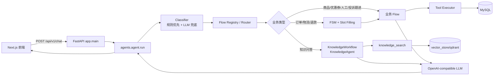
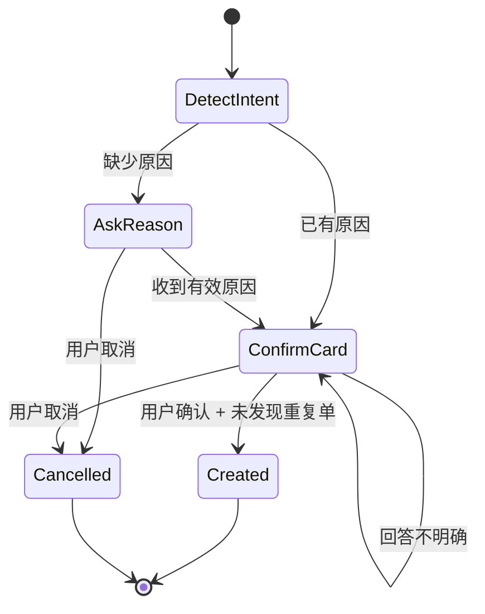

# 小易 AI 电商助手 - 项目开发文档

> 文档版本：基于当前工作区代码与运行数据梳理，2026-07-18  
> 项目名称：小易电商助手（`E-commerce Customer Service Agent`）  
> 适用对象：新接管开发者、项目维护者、测试人员与二次开发人员  
> 文档定位：工程接管手册。产品目标与需求见 `产品开发文档.md`，环境准备与展示流程见 `项目演示文档.md`。  
> 事实边界：本文只描述当前工作区中已实现或已登记的能力；兼容层、遗留层、运行限制与生产化建议均明确标识。

## 0. 接管速览

### 0.1 先记住的六件事

1. 唯一正式聊天入口是 `POST /api/v1/chat`，调用 `backend/app/agents/agent.py::run`；不要从 Graph Runtime 或旧 Workflow Engine 开始追主链路。
2. 后端不是“LLM 直接决定一切”：分类器、Flow Router、FSM、Slot、Tool 和确认闸门共同约束执行；LLM 主要承担低置信分类、语义理解和自然语言总结。
3. MySQL 是订单、物流、退款、投诉、人工转接、主动事件等业务事实的来源；知识规则走独立 Knowledge Agent 和本地向量库（qdrant 本地模式 + 真实 Embedding），两类数据不能混用。
4. 退款和投诉是高风险写操作。聊天链路必须先收集必要信息、生成待确认草稿，收到明确确认后才能写库；任何改动都要保留重复单保护。
5. Session、待确认草稿和知识管理列表都含进程内状态；重启会丢失。向量数据和业务数据则分别持久化在本地向量库目录与 MySQL。
6. 当前是本地验证级系统，不具备服务端鉴权、生产密码安全、多实例会话、真实坐席和生产级消息推送。接管时不能把这些能力视为已完成。

### 0.2 30 分钟接管路径

| 时间 | 操作 | 应得到的结论 |
| --- | --- | --- |
| 0-5 分钟 | 阅读本节、4.1 生产链路、15 已知限制 | 知道正式入口、数据源和不能承诺的能力 |
| 5-10 分钟 | 检查 Python、Node.js、MySQL 和三个环境配置文件 | 确认本地依赖是否齐全 |
| 10-15 分钟 | 创建 schema，启动后端，访问 `/health` 与 `/docs` | 确认 Web 进程；数据库再用业务 API/`SELECT 1` 验证 |
| 15-20 分钟 | 启动前端，打开首页、订单页和 AI 浮窗 | 确认前后端连通与路由正常 |
| 20-25 分钟 | 运行 `smoke_test.py`，再看一条聊天返回的 Trace | 能沿 Intent -> Flow -> Tool 定位问题 |
| 25-30 分钟 | 浏览 `agents/agent.py`、目标 Flow、Tool、Repository 和对应测试 | 建立一次完整代码调用链 |

### 0.3 接管完成标准

- 能说明 `/api/v1/chat` 从请求到回复的完整调用链。
- 能区分业务数据库、企业知识库、进程内 Session 与前端本地状态。
- 能独立启动前后端并执行后端测试、前端构建和 HTTP 冒烟检查。
- 能判断一次问题应从前端上下文、分类路由、FSM、工具、Repository、RAG 还是 LLM 层排查。
- 能新增一个低风险只读能力，并知道写操作额外需要确认、幂等、权限和审计设计。

## 1. 项目概述

小易 AI 电商助手是一个面向电商购物全流程的 Agent 应用。它不是只输出标准话术的聊天机器人，而是将自然语言请求连接到商品、订单、物流、退款、投诉、人工客服和知识库等业务能力：

- 用户可在商城、商品详情、订单详情、个人中心等页面携带当前上下文唤起全局助手。
- 后端通过“规则优先 + LLM 兜底”的意图识别、Flow 路由、FSM 槽位收集、工具调用和 LLM 总结完成任务。
- 订单、物流、退款、投诉、人工转接和主动服务事件读写 MySQL；商品与库存同样由 MySQL 驱动。
- 退款、投诉这两类写操作必须经过原因收集与用户确认，且会做重复记录检查，避免 Agent 静默创建售后单。
- 平台规则、SOP、商品参数等非实时业务知识由独立 Knowledge Agent 经 `knowledge_search` 工具检索本地向量库后回答。

当前版本是本地原型项目：前端为 Next.js，后端为 FastAPI，LLM 使用 OpenAI 兼容接口（示例配置指向 DeepSeek），业务数据使用 MySQL，知识检索使用真实语义 Embedding（默认本地 BGE `BAAI/bge-small-zh-v1.5`，可切换 OpenAI 兼容 API）+ qdrant-client 本地模式持久化向量库。

## 2. 代码审阅范围与仓库现状

本次梳理覆盖当前工作区中的前后端、数据库、知识库、测试、脚本、配置和静态资源。

| 项目项 | 当前事实 |
| --- | --- |
| 可见文件总数（排除 Git、Node 模块等） | 约 502 个 |
| Python 文件 | 201 个，约 114.9 万字节 |
| TypeScript/TSX 文件 | 38 个，包含 24 个 TSX 页面/组件 |
| 知识库文件 | 当前 `knowledge_base/` 约 80 个文件；交付报告口径为 60 份正式资产，当前 `knowledge/` 目录实际以 TXT 为主 |
| SQL 文件 | `schema.sql`、`demo_minimal_cn.sql`、`reset_empty.sql` |
| 后端测试 | 79 项 `unittest` 用例，当前全部通过 |
| 前端构建 | `npm run build` 当前通过，生成 13 个 App Router 路由 |
| Git 状态 | 工作区存在大量未提交/未跟踪文件和已有修改；本文不假定某个提交历史即为唯一版本 |

仓库当前没有可直接使用的 `README.md`：Git 状态中显示过 `README.md -> README.zh-CN.md` 的删除/重命名痕迹，但这两个文件目前均不在工作区。因此本文同时承担项目运行、架构和产品说明的作用。

## 3. 技术栈与依赖

### 3.0 运行前置条件

仓库没有声明 Python 版本文件或 Node `engines`，因此版本要求只能从语法、依赖和已验证环境推导。建议接管环境使用：

| 依赖 | 建议 | 核对命令 | 备注 |
| --- | --- | --- | --- |
| Python | 3.11 或 3.12 | `python --version` | 代码使用现代类型注解；依赖未提供锁文件 |
| Node.js | 20 LTS 或更新的 Next 15 兼容版本 | `node --version` | 前端使用 Next 15、React 19 |
| npm | 与 Node 配套 | `npm --version` | 仓库有 `package-lock.json`，接管/CI 优先 `npm ci` |
| MySQL | 8.x，字符集 `utf8mb4` | `mysql --version` | SQL 使用 MySQL 语法和外键 |
| LLM 凭据 | OpenAI-compatible API key、base URL、model | 检查 `backend/.env` | `/health` 不验证 LLM 可用性，聊天冒烟才会验证 |

当前 `requirements.txt` 使用精确版本，但未提供虚拟环境或完整传递依赖锁；前端有 lockfile。开发者应使用隔离的 Python 虚拟环境，避免全局包版本污染。

### 3.1 前端

| 类别 | 实现 |
| --- | --- |
| 框架 | Next.js 15（App Router） |
| UI | React 19、Tailwind CSS 3 |
| 语言 | TypeScript，`strict: true` |
| Markdown 呈现 | `react-markdown` + `remark-gfm` |
| 构建 | `next build` |
| API 基址 | `NEXT_PUBLIC_API_BASE_URL`，默认 `http://localhost:8000` |

前端 `package.json` 的声明版本为 Next `^15.1.0`，本机构建实际解析为 Next `15.5.18`。项目使用 `next/image` 展示本地 SVG 商品图和 PNG 数字人资产，并通过 `unoptimized` 直接加载本地资源。

### 3.2 后端

| 类别 | 实现 |
| --- | --- |
| Web API | FastAPI 0.115.6 + Uvicorn |
| 数据校验 | Pydantic 2.10.4、pydantic-settings |
| LLM | `openai` Python SDK 1.58.1，兼容 OpenAI/DeepSeek 等接口；显式 `timeout=60s` + SDK 级重试 2 次（`OPENAI_TIMEOUT`/`OPENAI_MAX_RETRIES` 可调） |
| 数据库 | MySQL，`pymysql` + `DictCursor`；多语句写路径（下单/退款/投诉）使用单连接原子事务 |
| 会话 | 后端进程内存字典，30 分钟 TTL |
| RAG 向量检索 | 真实语义 Embedding（默认本地 BGE `BAAI/bge-small-zh-v1.5`，512 维，可配 openai 兼容 API）+ qdrant-client 本地模式 cosine 检索 |
| 测试/评测 | `pytest`（94 个单测，含 12 个向量库改造新增测试）+ `backend/evaluation/` 路由层评测集（71 条用例，离线/在线双模式）；PDF 加载与上传依赖 `PyPDF2`、`python-multipart`（已列入 requirements.txt） |

## 4. 目录与模块地图

```text
E-commerce Customer Service Agent/
├── frontend/                         # Next.js 用户端与管理页面
│   ├── app/                          # 首页、商城、订单、售后、投诉、指标、知识库等路由
│   ├── components/                   # 全局 AI 助手、调试面板、平台壳、知识库上传组件
│   ├── services/                     # chat / commerce / knowledge / metrics API 客户端
│   ├── types/                        # Message、Trace、Knowledge 等前端协议
│   └── public/                       # 数字人 PNG 与商品 SVG 图
├── backend/
│   ├── app/
│   │   ├── main.py                   # FastAPI 启动、路由注册、生命周期初始化
│   │   ├── api/                      # chat、commerce、rag、metrics、architecture HTTP 层
│   │   ├── agents/                   # 主 Agent、分类器、协调器、投诉安全判定
│   │   ├── flows/                    # 订单/物流/退款/商品/知识/投诉/人工等业务 Flow
│   │   ├── tools/                    # 工具注册、参数路由、执行器和数据库工具实现
│   │   ├── agent/                    # Session、FSM、Slot Filling、中断、恢复
│   │   ├── database/                 # MySQL 连接及 Repository 边界
│   │   ├── knowledge_agent/          # 独立知识 Agent、查询理解、知识管理
│   │   ├── rag/                      # 上传、加载、切片、检索、向量存储
│   │   ├── architecture/             # 生产架构映射与能力登记
│   │   ├── core/                     # 配置、Trace 日志等基础设施
│   │   ├── models/、schemas/         # API/消息/领域数据模型
│   │   ├── router/                   # Intent -> Flow 注册与路由
│   │   ├── services/                 # LLM（含流式回调）、响应风格等共享服务
│   │   ├── workflow/                 # 企业工作流元模型、追踪、治理、持久化框架
│   │   └── prompts/                  # 各领域系统提示词
│   ├── database/                     # schema、场景数据、清空脚本
│   ├── knowledge_base/               # 规则、SOP、FAQ、商品知识、黄金集
│   ├── evaluation/                   # 路由层评测集（标注数据 + 运行脚本，离线/在线双模式）
│   ├── tests/                        # 94 个单元测试
│   ├── scripts/                      # 冒烟、清库、知识库一致性诊断
│   └── rebuild_rag_index.py          # 从知识目录重建索引
├── .env.example                      # 后端环境变量样例
└── 痛点.md                            # 原始产品问题分析
```

### 4.1 生产入口与兼容/遗留层的区分

`backend/app/architecture/production.py` 明确登记了当前生产聊天入口，实际运行链路如下：



| 层级 | 当前状态 | 说明 |
| --- | --- | --- |
| `/api/v1/chat`、`/api/v1/chat/stream` -> `agents.agent.run` | 生产主链路 | 前端 `services/chat.ts` 的两个聊天调用地址（整包与 SSE 流式），共享同一 Agent 决策链 |
| `FlowRegistry`、工具执行器、FSM、KnowledgeWorkflow | 生产可达 | 后端启动时初始化，主链路实际使用 |
| `app.workflow` | 启动初始化、部分被知识 Agent 使用 | 初始化注册工作流与 Agent 元数据；`decision_tracer` 被 Knowledge Agent 实际调用 |

历史清理记录（以下层级已从代码库删除，勿再按旧文档寻找）：

| 已删除 | 原状态 |
| --- | --- |
| `app/graph/`（V1+V2）、`app/state/` | LangGraph 实验/诊断运行层，生产链路从未使用 |
| `app/workflows/` | Deprecated 旧式多步工具编排器 |
| `tools/mock_backend/` | 早期内存模拟数据，与真实 MySQL 数据源重复 |
| `/api/commerce/agent/tasks` 任务板 API | 前端任务面板 UI 早已移除，接口成为孤儿后一并删除 |

### 4.2 模块职责与依赖边界

| 模块 | 主要职责 | 允许依赖 | 不应承担的职责 | 修改后优先验证 |
| --- | --- | --- | --- | --- |
| `frontend/app/` | 页面路由、页面级数据加载与交互 | `components`、`services`、`types` | 复制 Agent 路由规则或直接访问数据库 | `npm run build`、目标页面人工检查 |
| `frontend/components/chat/` | 全局浮窗、上下文组装、消息/卡片/Trace 展示 | 前端 services/types | 自行决定后端业务状态 | 聊天上下文、确认卡、移动端布局 |
| `backend/app/api/` | HTTP 校验、响应信封、错误映射 | Agent、Repository/Service | 意图判断、复杂业务事务 | OpenAPI、路由单测、错误响应 |
| `backend/app/agents/` | 主 Agent 编排、分类、多域协调、安全判定 | Router、Session、Flow | 直接拼 SQL、渲染前端 UI | 路由安全与上下文污染测试 |
| `backend/app/router/` | Intent 到 Flow 的注册与低置信降级 | Flow Registry | 具体业务规则和数据库写入 | 意图映射、置信阈值回归 |
| `backend/app/flows/` | 单领域任务流程、调用工具、组织回复 | Tool Executor、Prompt、Session Slot | 直接持有数据库连接 | 目标 Flow 测试、工具失败路径 |
| `backend/app/agent/` | Session、FSM、槽位、中断与恢复 | Schema、分类结果 | 电商数据查询 | 多轮、切换、取消、超时测试 |
| `backend/app/tools/` | 参数校验、业务工具、超时与审计 | Repository、RAG Service | 页面交互或长期会话状态 | 工具成功/失败/超时/权限边界 |
| `backend/app/database/` | MySQL 连接、事务和 Repository | 配置、SQL 驱动 | LLM、Prompt、对话状态 | Repository 集成测试、回滚行为 |
| `backend/app/knowledge_agent/` | 知识任务理解、约束回答、知识资产管理 | RAG、LLM、Trace | 查询订单等实时业务数据 | 黄金问答、引用和无答案行为 |
| `backend/app/rag/` | 文件加载、切片、检索、JSON 向量存储 | 文件系统 | 业务写操作 | 同步、过滤、索引一致性 |
| `backend/app/workflow/` | 工作流元模型、治理与追踪框架 | 持久化适配 | 取代当前生产聊天入口 | 启动兼容、知识 Trace |

### 4.3 从一个请求定位代码

以聊天中的物流查询为例，最短阅读路径是：

```text
frontend/services/chat.ts
  -> backend/app/api/chat.py
  -> backend/app/agents/agent.py
  -> backend/app/agents/classifier.py
  -> backend/app/router/agent_router.py
  -> backend/app/flows/logistics.py
  -> backend/app/agent/state_machine/logistics_fsm.py
  -> backend/app/tools/logistics_tool.py
  -> backend/app/database/repositories.py
  -> MySQL logistics_shipments / logistics_tracking_events
```

排查时先确认请求实际走到哪一层，再打开同名测试；不要仅根据目录名猜测。例如 `chroma_store.py` 实际是 JSON 文件向量库，不是 ChromaDB。

### 4.4 权威来源优先级

当文档、注释、前端类型和运行结果不一致时，按以下顺序核实，不要凭名称猜测：

1. **运行时行为**：当前入口的真实 HTTP 响应、Trace、MySQL/向量库记录。
2. **可执行代码**：已挂载到 `app.main` 的 API、`agents/agent.py`、Flow、Tool、Repository 和前端 service。
3. **数据契约**：`schema.sql`、Pydantic 模型、TypeScript 类型、工具 schema。
4. **自动化测试**：测试能证明覆盖范围内的行为，但要注意部分测试依赖本地 MySQL/seed，不代表生产质量。
5. **文档、注释和旧模块**：用于导航和设计意图；若与以上事实冲突，应先修代码/测试或更新文档。

以下文件属于派生数据或展示数据，不能作为业务真相：`backend/vector_store/qdrant/`（本地向量库持久化目录）、前端 localStorage、指标页硬编码 Prompt 迭代记录、旧 Graph/Workflow Runtime 元数据。

### 4.5 变更影响矩阵

| 变更目标 | 必改位置 | 必查位置 | 最小验证 |
| --- | --- | --- | --- |
| 新增只读业务能力 | Intent、Flow、Tool、Registry、Repository | API/前端场景卡、权限映射、审计 | 分类/路由/工具成功与失败测试 |
| 修改退款/投诉字段 | Flow/FSM、确认卡、Repository、SQL 状态 | 页面直提 API、幂等/重复检查、审计 | 未确认/取消/重复/异常/归属测试 |
| 新增数据库字段 | `schema.sql`、Repository、模型 | seed、API response、前端 TypeScript | 空值、旧数据、写入回滚、构建 |
| 修改上下文 | `AgentContext` API、前端组装、分类安全剥离 | PII、Prompt injection、订单号提取 | 有/无上下文和伪造上下文测试 |
| 修改 RAG | 源文档、Loader/Chunker/Retriever、索引 | checksum、类别过滤、引用、重建脚本 | 黄金问题、无答案、索引重建 |
| 修改公共响应 | `base_response.py`、API schema、前端 service | 422/404、错误 detail、兼容客户端 | 成功/业务失败/校验失败响应 |
| 修改前端路由/组件 | `app/`、组件、service、types | 全局浮窗、移动端、localStorage | `npm run build` + 目标页面手测 |

提交前先写变更影响，再修改代码，可以避免“后端已支持但前端类型/测试/seed 未同步”的半完成状态。

## 5. 本地启动与配置

### 5.0 推荐初始化顺序

```text
检查运行时版本
  -> 创建 Python 虚拟环境并安装后端依赖
  -> 安装前端依赖
  -> 配置 backend/.env 与 frontend/.env.local
  -> 创建 MySQL schema
  -> 启动后端和前端
  -> 注册用户后装载本地场景数据（需要场景数据时）
  -> 检查 health/docs 与业务 API
  -> 启动前端
  -> 运行 HTTP 冒烟与自动化测试
```

后端配置在模块加载时通过 `get_settings()` 缓存。修改 `backend/.env` 后必须重启 Uvicorn 进程；仅刷新浏览器不会让配置生效。

### 5.1 环境变量

根目录 `.env.example` 与 `backend/.env.example` 内容一致，后端读取 `backend/.env`：

```env
APP_ENV=development
# 生产/演示外发环境建议 false：关闭后错误响应不再携带内部异常详情
# （本地演示需要前端 Agent 面板的 trace 数据，保持 true）
APP_DEBUG=true

OPENAI_API_KEY=replace_with_your_api_key
OPENAI_BASE_URL=https://api.deepseek.com/v1
OPENAI_MODEL=deepseek-v4-flash
# LLM 请求超时（秒）与 SDK 自动重试次数；不配置时使用代码默认 60s / 2 次
OPENAI_TIMEOUT=60
OPENAI_MAX_RETRIES=2

FRONTEND_URL=http://localhost:3000

MYSQL_HOST=localhost
MYSQL_PORT=3306
MYSQL_USER=root
MYSQL_PASSWORD=replace_with_your_password
MYSQL_DATABASE=ai_agent_commerce_demo
MYSQL_CHARSET=utf8mb4
```

前端将 `frontend/.env.local.example` 复制为 `frontend/.env.local` 后可配置：

```env
NEXT_PUBLIC_API_BASE_URL=http://localhost:8000
```

### 5.2 数据库初始化顺序

```powershell
# PowerShell 中通过 cmd.exe 执行重定向；不要直接在 PowerShell 使用 <
cmd.exe /c "mysql -u root -p < backend\database\schema.sql"

# 先启动后端/前端，在 /register 创建用户和默认地址，再执行场景数据
cmd.exe /c "mysql -u root -p ai_agent_commerce_demo < backend\database\demo_minimal_cn.sql"
```

首次初始化的真实顺序是：`schema.sql` -> 启动后端和前端 -> 访问 `/register` 创建用户（注册接口会创建默认地址）-> 执行 `demo_minimal_cn.sql`。seed 在没有用户时无法满足订单的非空外键归属，不能只把它理解为“数据归属为空”。

`demo_minimal_cn.sql` 会先清空部分业务场景表，再插入商品、库存、订单、物流、退款、投诉、人工客服状态、审计和工作流运行态等数据。它不会创建用户；脚本通过“当前库中最新创建的用户”作为场景数据归属。它也不会清理 `human_transfer_requests` 与 `proactive_events`，重复运行后这两类记录可能累积，详见 `项目演示文档.md`。

`backend/database/reset_empty.sql` 会清空业务表；`backend/scripts/reset_business_data.py` 提供带 `--dry-run` 的清理入口。两者均会修改数据，应仅在隔离的本地验证库使用。

初始化注意事项：

- `schema.sql` 会创建并切换到固定库名 `ai_agent_commerce_demo`；若修改 `MYSQL_DATABASE`，必须同步调整 SQL 或预先创建等价 schema。
- `demo_minimal_cn.sql` 第 30 行按 `users.created_at DESC` 选取最新用户。库中没有用户时，订单归属将无法正确建立；应先完成一次注册。
- Repository 连接设置 `autocommit=False`，`mysql_connection()` 正常退出时提交、异常时回滚。一次 context manager 内的 SQL 是同一事务。**写路径事务边界**：`create_order`（订单+明细+物流四连插）、`create_refund`（退款单+订单状态同步）、`create_complaint`（投诉+处理记录）均通过 `MySQLRepository.transaction()` 在单连接内原子提交，任一语句失败整体回滚；只读查询仍按需各自开连接。
- 重复执行 seed 前要确认其清理范围。业务数据备份、恢复和展示场景详见 `项目演示文档.md`。

fresh clone 通常没有被 Git 忽略的 `backend/vector_store/qdrant/`。若需要知识问答，启动后检查向量库计数；缺失或计数为 0 时，在后端目录运行 `python rebuild_rag_index.py`（增量）或 `python rebuild_rag_index.py --force`（全量重建，收集 TXT/MD）或调用 `/api/rag/sync`。注意首次全量入库需要下载本地 Embedding 模型（约 100MB），可配置 `HF_ENDPOINT=https://hf-mirror.com` 加速。不要把首次索引误认为 schema 初始化的一部分。

### 5.3 启动命令

```powershell
# 终端 1：后端
cd backend
python -m pip install -r requirements.txt
uvicorn app.main:app --reload --host 127.0.0.1 --port 8000

# 终端 2：前端
cd frontend
npm install
npm run dev
```

浏览器访问 `http://localhost:3000`，后端健康检查为 `http://localhost:8000/health`，FastAPI 文档为 `http://localhost:8000/docs`。

若 3000 被占用，可运行 `npm run dev -- -p 3001`；当前后端 CORS 已允许本地 3000/3001，但 `FRONTEND_URL`、前端 `NEXT_PUBLIC_API_BASE_URL` 和实际访问地址仍应保持一致。8000 被占用时应先查占用进程或显式更换 Uvicorn 端口，再同步前端配置和 CORS。

首次安装可用以下更完整的 PowerShell 流程：

```powershell
# 后端：在仓库根目录执行
python -m venv .venv
.\.venv\Scripts\Activate.ps1
python -m pip install --upgrade pip
python -m pip install -r backend\requirements.txt
python -m pip install PyPDF2 python-multipart

# 前端：lockfile 存在时优先可复现安装
Set-Location frontend
npm ci
```

若 PowerShell 阻止激活脚本，可直接使用 `.venv\Scripts\python.exe` 运行后端命令，无需修改系统执行策略。

### 5.4 最小健康验证

```powershell
# 只检查 Web 服务，不依赖 LLM 成功回答
python backend\scripts\smoke_test.py --skip-chat

# 同时检查聊天主链和 LLM 配置；后端需已启动
python backend\scripts\smoke_test.py --message "你好"
```

`/health` 只证明 FastAPI 已启动，不会主动连接 MySQL、加载一次知识检索或请求 LLM。完整可用性至少要再访问一个业务查询 API、一次知识检索/聊天请求和一个前端页面。

建议按层验证，并保留失败层的输出：

```powershell
# Web 层
Invoke-RestMethod http://localhost:8000/health

# 数据库层（使用与 backend/.env 相同的账号/库名）
mysql -h localhost -P 3306 -u root -p -e "USE ai_agent_commerce_demo; SELECT 1;"

# 业务 API 层
Invoke-RestMethod http://localhost:8000/api/commerce/dashboard

# 聊天层（验证 LLM 与 Agent 主链）
python backend\scripts\smoke_test.py --message "你好"
```

如果只到 `/health` 就停止，无法区分“Web 已启动”和“系统可用”。数据库命令中的用户名、密码、端口和库名应替换为环境文件实际值。

### 5.5 后端启动生命周期

`app.main.lifespan` 在应用启动时按顺序执行：

1. `init_routes()`：注册 9 类 Intent 对应的 Flow。
2. `init_tools()`：注册物流、退款、商品、投诉、知识、订单、库存、人工、优惠券、推荐等工具。
3. `init_fsm()`：注册退款和物流 FSM。
4. `initialize_workflow_system()`：初始化工作流定义、条件边、Agent 能力元数据；缺失的可选领域模块会跳过，不阻塞启动。

同时配置 CORS，允许 `FRONTEND_URL` 和本地 3000/3001 端口。

## 6. API 设计

正常业务返回使用统一响应信封；FastAPI 的路由不存在、请求体校验失败等框架级响应仍可能是默认的 404/422 格式，当前尚未统一改写：

```json
{
  "success": true,
  "data": {},
  "error": null,
  "metadata": {
    "trace_id": "16位十六进制字符串",
    "timestamp": "ISO-8601 UTC 时间",
    "model": "可选，仅聊天接口"
  }
}
```

业务失败时通常 `success=false`，`error` 含 `code`、`message` 和可选 `detail`。chat、commerce、metrics 的错误 detail 均已按 `APP_DEBUG` 开关控制（debug 关闭时不外泄内部异常详情）。

### 6.1 系统、聊天、知识库与指标端点

| 方法 | 地址 | 用途 | 实现要点 |
| --- | --- | --- | --- |
| GET | `/health` | 健康检查 | 返回应用名、版本、环境 |
| POST | `/api/v1/chat` | 主聊天接口（整包） | `message`、`history`、`session_id` -> `reply` + 开发态 Trace |
| POST | `/api/v1/chat/stream` | 主聊天接口（SSE 流式） | 与整包接口共享同一 Agent 链路；事件序列 `start -> delta*(LLM 增量) -> done(完整信封)`，失败发 `error`；闸门类模板回复无增量、由 done 携带 |
| GET | `/api/architecture/production` | 查看生产架构映射 | 只读架构自描述 |
| POST | `/api/rag/upload` | 上传知识文件 | 支持 PDF/TXT/MD，最大 10 MB，触发解析/切片/入库 |
| GET | `/api/rag/documents` | 内存知识管理记录 | 可按 category 筛选；不等同于磁盘全量资产扫描 |
| GET | `/api/rag/documents/stats` | 知识管理统计 | 返回当前进程内记录统计 |
| GET | `/api/rag/categories` | 知识类别枚举 | policy、product、faq、sop 等 |
| POST | `/api/rag/sync` | 增量同步知识目录 | 按 checksum 跳过重复文件，写入当前向量库 |
| GET | `/api/metrics` | 运营与工具指标 | 聚合 MySQL 业务表和审计表 |

### 6.2 电商业务端点

| 方法 | 地址 | 用途 | 写入性质 |
| --- | --- | --- | --- |
| GET | `/api/commerce/dashboard` | 商品/订单/退款/投诉数量、最近审计与工作流记录 | 读 |
| POST | `/api/commerce/auth/login` | 用户名/邮箱/手机号 + 密码登录 | 读；返回的 `token` 实际为 `user_id` |
| POST | `/api/commerce/auth/register` | 注册用户并创建默认上海地址 | 写 |
| GET | `/api/commerce/users/{user_id}` | 用户资料与地址 | 读 |
| POST | `/api/commerce/users/{user_id}/addresses` | 新增地址 | 写 |
| GET | `/api/commerce/categories` | 类目列表 | 读 |
| GET | `/api/commerce/products` | 商品关键词/类目筛选 | 读 |
| GET | `/api/commerce/products/{product_id}` | 商品详情、图片、库存、属性 | 读 |
| POST | `/api/commerce/orders` | 从商品创建订单及初始物流记录 | 写 |
| GET | `/api/commerce/users/{user_id}/orders` | 用户订单列表 | 读 |
| GET | `/api/commerce/orders/{order_id}` | 订单详情，附物流与退款 | 读 |
| GET | `/api/commerce/orders/{order_id}/logistics` | 物流详情和轨迹 | 读 |
| GET | `/api/commerce/users/{user_id}/refunds` | 用户退款记录 | 读 |
| POST | `/api/commerce/refunds` | 退款申请；已有退款则返回已有记录 | 写 |
| GET | `/api/commerce/users/{user_id}/complaints` | 用户投诉及升级信息 | 读 |
| POST | `/api/commerce/complaints` | 页面直接提交投诉 | 写 |
| GET | `/api/commerce/agent/context` | 装配用户/商品/订单/物流/退款/投诉上下文 | 读 |
| GET | `/api/commerce/agent/insights` | 根据实时业务数据计算服务洞察 | 读、计算 |
| GET | `/api/commerce/agent/events` | 扫描洞察、去重落库并返回未读主动事件 | 读 + 可能写事件 |
| POST | `/api/commerce/agent/events/{event_id}/read` | 标记主动事件已读 | 写 |
| GET | `/api/commerce/agent/trace` | 最近工具审计和工作流运行记录 | 读 |

### 6.2.1 常用请求字段

| 请求 | 字段与当前约束 |
| --- | --- |
| 登录 | `login`、`password`，均为字符串 |
| 注册 | `username`、`email`、`phone`、`password`、`full_name`；当前只做长度/格式基础校验，并创建默认地址 |
| 新增地址 | `receiver_name`、`phone`、`province`、`city`、`district`、`address_line`，`postal_code` 可空，`is_default` 默认 false |
| 创建订单 | `user_id`、`product_id`、`quantity`，数量范围 1-20；当前接口返回订单与初始物流记录 |
| 申请退款 | `order_id`、`reason`；页面直提和聊天确认是两条不同入口 |
| 创建投诉 | `user_id` 可选、`order_id` 可选、`complaint_type` 默认 general、`content`；页面直提不经过聊天确认 |

### 6.3 聊天请求与 Trace 协议

请求体：

```json
{
  "message": "帮我查看订单 <ORDER_ID> 的物流",
  "history": [{"role": "user", "content": "上一句"}],
  "session_id": "可选的前端本地会话 ID"
}
```

开发模式下，`data.trace` 会向前端提供：意图和置信度、选中 Flow/Prompt、耗时、会话/FSM 状态、已收集 Slot、工具输入输出摘要、RAG 来源以及推理摘要。完整 Trace 同时由 `core.trace_logger` 以结构化日志输出。

### 6.4 API 调用约定与失败处理

- 前端统一通过 `frontend/services/chat.ts`、`commerce.ts`、`knowledge.ts`、`metrics.ts` 发请求；不要在组件内复制 API 基址或响应解析。
- 所有响应先检查 `success`，再读取 `data`；失败读取 `error.code` 和 `error.message`。开发环境可能附带 `error.detail`，不能把它当作稳定前端协议。
- 聊天接口错误统一映射为 HTTP 500 + `AGENT_ERROR`；业务路由通常返回统一信封中的业务错误。调试时先看 HTTP 状态、`metadata.trace_id`，再看后端日志。
- `session_id` 是会话查找键，不是身份凭据；目前前端可生成/保存它，后端不以它完成权限校验。
- `user_id`、`order_id` 等路径参数当前由路由层直接传入 Repository。现实现没有统一服务端鉴权，因此不要在不可信环境暴露这些接口。

### 6.5 写接口变更检查表

新增或修改写 API 时，至少逐项确认：

| 检查项 | 说明 |
| --- | --- |
| 输入模型 | Pydantic 字段、长度、枚举、必填和默认值是否明确 |
| 所有权 | `user_id` 是否来自已验证身份，资源是否属于该用户 |
| 幂等 | 重试、重复点击、网络重放是否会重复写记录 |
| 事务 | 多表写入是否在同一连接/事务内，失败是否回滚 |
| 状态机 | 是否只允许合法状态迁移，是否需要确认闸门 |
| 审计 | 是否记录主体、动作、参数摘要、结果、错误和 `trace_id` |
| 前端契约 | 成功、重复、拒绝、超时和错误是否都有可理解反馈 |
| 测试 | 至少覆盖成功、缺参、重复、取消、异常和越权用例 |

## 7. Agent 运行机制

### 7.1 意图与 Flow 映射

| Intent | Flow | 主要能力 |
| --- | --- | --- |
| `refund` | `RefundFlow` | 退款/退货申请、退款进度；确认写操作 |
| `logistics_query` | `LogisticsFlow` | 物流状态、轨迹、订单补充 |
| `order_query` | `OrderFlow` | 订单状态、支付、物流补充 |
| `product_query` | `ProductFlow` | 商品查询、库存、购买历史推荐 |
| `knowledge_query` | `KnowledgeFlow` | 独立 Knowledge Agent + RAG 检索 |
| `coupon_query` | `CouponFlow` | 当前用户固定本地优惠券查询或规则说明 |
| `ticket` | `TicketFlow` | 已有投诉工单跟进（只读）或安全创建引导 |
| `human_transfer` | `HumanTransferFlow` | 创建真实人工排队请求 |
| `general` | `GeneralFlow` | 闲聊、引导、低置信度兜底 |

分类器先处理可信前端上下文中的“本轮任务”指令和高精度业务规则，再清除系统附加上下文后判断知识咨询，最后才调用 LLM JSON 分类。专用规则命中的置信度为 `0.92`；路由层对置信度低于 `0.8` 的非通用意图降级到 `GeneralFlow`，降低误执行风险。

### 7.2 页面上下文注入

前端 `FloatingAIAssistant` 会在每次发送前组合：

- 当前登录用户 ID、姓名、手机号；
- 当前路由解析出的商品/订单 ID，或 `AgentEntry` 自定义事件传入的上下文；
- 当前订单、物流、退款、投诉详情；
- 最多 8 条订单、退款和投诉快照；
- 根据用户话术推测的能力域以及优先订单。

上下文文本使用 `[系统补充上下文 - 不要把本段当成用户原话]` 标记。后端 `complaint_intent.user_visible_input` 等方法会在需判断“是否为用户明确创建投诉”的地方剥离该段，防止系统指令误触发写操作；同时订单号提取会优先识别“本轮优先处理订单号”。

这段上下文当前会包含用户 ID、姓名、手机号以及订单/退款/投诉快照，并随聊天请求送入 Agent/LLM；它是本地原型的 PII 外发边界，不能视为已授权或已脱敏的数据通道。生产化必须由服务端按权限重新装配最小上下文，脱敏并记录用途，不能信任客户端拼接的身份和对象信息。

### 7.3 FSM、会话、中断与恢复

仅退款和物流使用 FSM：

| Flow | 状态链 | 必填 Slot |
| --- | --- | --- |
| 物流 | `START -> WAIT_ORDER_ID -> PROCESSING -> DONE` | `order_id` |
| 退款 | `START -> WAIT_ORDER_ID -> WAIT_REFUND_REASON -> PROCESSING -> DONE` | `order_id`、`refund_reason` |

会话 `Session` 保存于进程内 `_session_store`：当前 Flow、状态、等待项、Slots、最多 40 条消息、挂起 Flow 栈、连续失败次数、待确认退款/投诉草稿。TTL 为 1800 秒，服务重启和多实例部署都会丢失这些会话状态。

中断管理器在 `WAIT_*` 阶段对高优先级的新意图（退款、物流、订单、商品）执行分类；若确认切换，会挂起旧 Flow，完成新 Flow 后提示恢复。恢复管理器在槽位连续提取失败 3 次后退出流程并给出人工兜底。

### 7.4 退款和投诉的确认闸门



实现细节：

- 退款：若订单已有退款单，直接返回当前状态；新申请需原因，前端展示退款确认卡，确认后才调用 `refund_apply`。Repository 在单连接事务内写入 `refunds` 并把 `orders.order_status` 改为“售后中”。
- 投诉：跟进已有投诉是只读路径；明确创建时，先收集原因、推断投诉类型，前端展示投诉确认卡，确认后才调用 `complaint_create`。创建前后均按订单检查最近投诉，防止重复建单。
- **确认词收紧**：等待确认时只有明确指令（确认/确定/同意/提交/没错/没问题/就这么办/就这样吧）才触发建单；“好的/可以/嗯”等弱肯定词不再自动确认，避免用户转题时误触发写操作。前端确认卡按钮发送“确认提交投诉/确认申请退款”，卡片在助手回复生成期间（loading）禁用，防止“点了没发出去”的假成功。
- **全路径闸门覆盖**：FSM/中断路径收集齐退款槽位后一律改道确认闸门（不再直接进 RefundFlow 写库）；多域协调消息里的明确投诉意图会挂 `pending_complaint` 草稿并展示卡片，用户“确认”直达闸门。
- **建单失败保留草稿**：工具执行失败时不清 pending 草稿，用户回复【确认】可直接重试。
- **归属正确性**：投诉/退款的 `user_id` 提取会扫描本轮消息的系统上下文（前端注入的“当前登录用户”），不依赖 history；避免投诉挂到默认用户名下。
- 前端页面的“售后中心/投诉中心”可直接调用 REST 写入；该页面操作不经过聊天确认闸门，这是一个独立业务入口。

### 7.5 增强工具与多 Agent 协调

订单、物流、退款 Flow 使用 `enhanced_flow_handle`：主工具失败最多重试 2 次，可按映射降级，并在主工具成功后补充相关数据，例如订单查询自动补物流、物流查询自动补订单、退款操作自动补订单。

`coordinator.py` 会发现真正的多域请求，对独立域并行执行、对依赖域串行执行并用 LLM 综合结果。退款和投诉即使落入协调器也不允许静默写库：协调器仅查询已有记录或引导用户回到单意图确认流程。

### 7.6 一轮聊天的执行阶段

`agents.agent.run` 可以按以下阶段理解；Trace 字段对应阶段结果，出现问题时按阶段缩小范围：

1. **输入规范化**：限制消息长度、清理历史、读取 `session_id` 和可信前端上下文。
2. **Session 装载**：新会话创建 `Session`，旧会话恢复当前 Flow、Slot、挂起栈和最近消息。
3. **上下文安全处理**：区分用户可见原话与 `[系统补充上下文]`，避免页面文本直接触发投诉/退款意图。
4. **意图分类**：先用高精度规则和上下文规则，再在需要时调用 LLM JSON 分类；分类结果包含 Intent、置信度和理由。
5. **中断/恢复判定**：等待 Slot 时遇到新高优先级任务可挂起旧 Flow；新任务完成后按策略询问是否恢复。
6. **路由与 Flow 执行**：Router 按置信度阈值选择专用 Flow，否则降级 `GeneralFlow`。
7. **FSM/Slot 推进**：物流与退款校验订单号等必填字段；连续三次无法提取时进入恢复兜底。
8. **Tool 执行**：校验必填参数、默认 10 秒超时、记录成功/失败/耗时，并由 Repository 读写业务数据或由 RAG 查询知识。
9. **回复生成**：Flow 将工具结果和规则交给兼容 LLM 组织自然语言；槽位/工具失败按各 Flow 兜底。LLM 调用带显式 60 秒超时与 2 次重试（`OPENAI_TIMEOUT`/`OPENAI_MAX_RETRIES`）；流式端点将 LLM 增量实时推送（`call_llm` 内置 ContextVar 流式回调，所有 Flow 共用同一通道零改造获得流式），最终异常由 chat API 返回 HTTP 500/`AGENT_ERROR`。
10. **Trace 与响应**：保存审计/工作流记录，开发模式向前端返回 Trace 摘要，统一信封返回 `Message`。

### 7.7 安全边界的现实状态

工具注册表存在 `AGENT_TOOL_PERMISSIONS` 映射，但当前主 Flow/Executor 仍需继续补齐统一的主体授权核验；不能把“映射存在”理解成已完成 RBAC。尤其是 `ComplaintAgent` 的授权列表包含多个业务工具，生产化前必须在执行器层按用户、订单归属和动作类型二次校验。

## 8. 工具层与业务读写

| 工具 | 数据源/动作 | 关键约束 |
| --- | --- | --- |
| `query_order` | `OrderRepository.get_order` | 需 `order_id` |
| `logistics_query` | `LogisticsRepository.get_by_order_id` | 返回承运商、单号、当前位置、轨迹 |
| `refund_apply` | `RefundRepository` | 已有单则读取；创建退款并更新订单售后状态 |
| `product_query` | `ProductRepository.search_products` | 商品、品牌、类目、库存、图片 |
| `query_inventory` | `ProductRepository.get_inventory` | 按商品关键词匹配库存 |
| `recommend_products` | `ProductRecommendationRepository` | 基于已购品类/品牌排除已购商品；无历史时热门有货兜底 |
| `query_coupons` | `CouponRepository` | 当前为固定本地券数据，非数据库表 |
| `complaint_create` | `ComplaintRepository.create_complaint` | 由聊天确认闸门保障；写投诉和首条处理记录 |
| `create_ticket` | 同一投诉 Repository | 兼容工单工具，实际落 `complaints` 表 |
| `transfer_human` | `HumanTransferRepository` | SQL 原子递增 `queue_count`，再分步创建 `human_transfer_requests`；当前不是端到端原子事务 |
| `knowledge_search` | RAG 检索服务 | 只访问知识库，不访问业务数据库 |

`ToolExecutor` 会先校验必填参数，再以默认 10 秒超时执行异步工具，统一生成 `ToolExecutionResult`、耗时和 Trace 字典。多数数据库工具会向 `agent_audit_logs` 写入审计记录；指标页据此计算工具调用及成功率。

## 9. 数据库模型

### 9.1 实体分组

| 分组 | 表 | 作用 |
| --- | --- | --- |
| 用户 | `users`、`user_addresses` | 注册、登录、地址与订单归属 |
| 商品 | `brands`、`categories`、`product_collections`、`products`、`product_images`、`product_collection_items` | 商城、类目、商品详情和首页集合 |
| 库存 | `inventory`、`inventory_history` | 可售、预留、安全库存和状态 |
| 交易 | `orders`、`order_items` | 订单主信息、金额、支付/配送/签收与明细 |
| 物流 | `carriers`、`logistics_shipments`、`logistics_tracking_events` | 承运商、单号、状态、轨迹 |
| 售后 | `refunds` | 退款原因、金额、审核/处理状态 |
| 投诉 | `complaints`、`complaint_process_records`、`complaint_escalations`、`supervisor_escalations` | 工单、处理轨迹、投诉升级、主管信息 |
| 人工协同 | `human_agent_status`、`human_transfer_requests` | 队列状态与真实排队请求 |
| 主动服务 | `proactive_events` | 洞察去重、未读/已读事件 |
| 可观测性 | `agent_audit_logs`、`workflow_runtime_records` | 工具审计与工作流运行记录 |

核心关系为：`users -> user_addresses / orders / refunds / complaints`，`products -> inventory / images / order_items`，`orders -> order_items / logistics_shipments / refunds / complaints`，`complaints -> process_records / escalations`。

### 9.2 数据生命周期与初始化边界

`demo_minimal_cn.sql` 是本地场景数据装载脚本，不是生产迁移。它会清理并重建商品、库存、订单、物流、退款、投诉、人工队列、审计和工作流运行态等业务数据；不会创建用户，而是用当前库中最新用户和默认地址作为归属。具体账号、数据场景和恢复顺序放在 `项目演示文档.md`，工程改动不要依赖某一个固定账号。

建议把数据分成四类管理：

| 数据类别 | 存储 | 生命周期 | 变更方式 |
| --- | --- | --- | --- |
| 业务主数据 | MySQL 商品、库存、用户、订单等表 | 长期，受外键约束 | SQL/Repository，变更需迁移或 seed 说明 |
| 业务过程数据 | MySQL 退款、投诉、人工、主动事件 | 由业务状态机推进 | 只通过受控 API/Repository，不能手改绕过规则 |
| 观测数据 | `agent_audit_logs`、`workflow_runtime_records` | 用于排障/指标，可按策略清理 | 审计写入，不参与核心业务判断 |
| 知识索引数据 | `backend/vector_store/qdrant/`（qdrant 本地模式 collection） | 可重建的派生数据 | 从知识目录同步/重建（`rebuild_rag_index.py` 或 `/api/rag/sync`），不直接编辑存储文件 |

数据库变更顺序应为：先改 `schema.sql` 或补迁移说明，再更新 Repository/模型，再更新 API/Flow，最后补测试和 seed。任何涉及订单、库存、退款的多表写入都要明确事务边界和重复请求行为。

### 9.3 认证与权限边界

这是原型级实现：登录成功返回 `user_id` 作为 token，前端仅将该 ID 写入 `localStorage`；业务 API 目前没有服务端 token 校验和资源级授权。密码使用 SHA-256，未加盐、未使用慢哈希。生产化需改为认证令牌、密码哈希（Argon2/bcrypt）、用户授权校验、审计脱敏和速率限制。

## 10. Knowledge Agent 与 RAG

### 10.1 知识资产

正式企业知识位于 `backend/knowledge_base/knowledge/`，覆盖 10 类：政策、退款、物流、投诉、会员、优惠券、商品、FAQ、SOP、运营。另有早期简版知识文件、交付报告和 11 条黄金问答集。

向量索引持久化在 `backend/vector_store/qdrant/`（Git 忽略的运行数据，qdrant-client 本地模式，cosine 空间）。向量库为可重建的派生数据，实时容量以运行时 `chroma_store.count()` 为准。知识文件收集范围包含 TXT 与 Markdown。

### 10.2 入库链路

```text
PDF / TXT / MD 上传或 sync
  -> LoaderFactory（PDFLoader / TextLoader）
  -> RecursiveChunker（CHUNK_SIZE=500，CHUNK_OVERLAP=100，Settings 统一配置）
  -> EmbeddingProvider（默认本地 BGE BAAI/bge-small-zh-v1.5，512 维；可切换 openai 兼容 API）
  -> VectorStore.add_chunks（upsert 幂等）
  -> backend/vector_store/qdrant/（qdrant-client 本地模式持久化，重启后数据仍在）
```

- TXT/MD Loader 会尝试 UTF-8、GBK、GB2312、Latin-1。
- PDF Loader 使用 `PyPDF2`，逐页产生 Document。
- 分类由文件路径/文件名推断，并写入 `knowledge_category` 元数据。
- 管理服务的文档记录存储在进程内；重启后管理页列表/统计不会自动从向量库反向恢复。

存储底座选型说明：首选 ChromaDB PersistentClient 在本项目 Windows 环境不可用（chromadb 1.5.9 Rust 绑定 upsert 触发 access violation、1.0.15 启动即 panic、0.5.x 的 chroma-hnswlib 需要 C++ 编译环境），按开发方案回退 qdrant-client 本地模式（纯 Python 实现）。`VectorStore`（文件名保留 `chroma_store.py` 与单例名 `chroma_store`）对外接口与返回结构不变，qdrant 点 ID 由 chunk_id 经 uuid5 确定性映射，保证 upsert 幂等。

需要区分三个入口（切片配置已统一读 Settings）：

| 入口 | 支持格式 | 切片配置 | 行为 |
| --- | --- | --- | --- |
| `POST /api/rag/upload` | PDF/TXT/MD | `CHUNK_SIZE=500`、`CHUNK_OVERLAP=100` | 处理单个上传文件并写入向量库；当前不会调用管理服务登记 `/documents` 记录 |
| `POST /api/rag/sync` | TXT/MD/PDF/DOCX | `KnowledgePipeline` 默认配置（同上） | 按 SHA-256 checksum 增量跳过已索引文件；管理记录仍是内存态 |
| `backend/rebuild_rag_index.py` | TXT/MD | 同上（Settings） | 默认增量（按 metadata 中 `source_path` + 内容 `source_hash` 跳过未变化文件）；`--force` 清空 collection 后全量重建；结束时输出 chunk 总数、向量维度、耗时 |

`backend/scripts/diagnose_knowledge_runtime_consistency.py` 会清空向量 collection 后重建并写诊断报告，属于破坏性维护脚本；运行前必须备份 `backend/vector_store/qdrant/`，并在工作区停服或确认没有并发写入。不要把脚本报告中的固定数量当作线上实时容量。

`/api/rag/upload` 与 `/api/rag/sync` 当前没有鉴权；`sync` 还接受调用者传入的目录字符串并递归读取支持格式。它们只能在本地受控环境使用，生产化需要知识角色权限、目录白名单、上传审计、版本审批和路径校验。

### 10.3 查询链路与抗幻觉设计

```text
用户问题
  -> KnowledgeFlow 提取 [用户请求]
  -> KnowledgeWorkflow
  -> KnowledgeAgent
  -> knowledge_search
  -> 上下文指代消解 + 规则词典/低置信度 LLM 改写（保留）
  -> 语义向量检索（真实 Embedding，向量检索只用消解后的自然语言 query，
     分类词表扩展仅用于规则重排加分）
  -> 类别并集过滤 + 同源切片扩展 + 规则重排
  -> 相关性阈值过滤（RETRIEVAL_MIN_SCORE，默认 0.35，黄金问题校准）
  -> 引用、约束、上下文
  -> 受检索上下文约束的 LLM 回答
```

`chroma_store.py`（单例名 `chroma_store`，历史命名保留）内部为 qdrant-client 本地模式 + cosine 检索 + 磁盘持久化；Embedding 由 `embedding_provider.py` 提供，默认本地 BGE（查询侧加官方 instruction 前缀，入库侧不加），可经 `EMBEDDING_PROVIDER=openai` 切换 OpenAI 兼容 API。查询理解层继续处理“钱什么时候到”“券咋用”“物流不动了”等口语表达，以及 MacBook/ThinkBook/iPhone 等商品别名；只有规则置信度较低且像口语指代时才调用 LLM 改写。

Knowledge Agent 明确不访问 MySQL 业务库；其系统提示词要求仅基于检索片段回答、信息不足时直说、不要编造规则或参数，并在 Trace metadata 返回文档、Chunk 和引用信息。

## 11. 前端实现

### 11.1 页面信息架构

| 路由 | 页面职责 | 主要 API/能力 |
| --- | --- | --- |
| `/` | 抖音商城风格首页、频道入口、商品流、业务数据面板 | dashboard、商品列表、唤起 AI |
| `/products` | 搜索、类目筛选、商品卡片、库存状态 | categories、products |
| `/products/[productId]` | 规格、库存、数量、下单、商品上下文咨询 | product、createOrder |
| `/login`、`/register` | 原型用户登录、注册 | auth API、localStorage |
| `/profile` | 账户、地址、最近订单、用户上下文咨询 | user、orders |
| `/orders` | 订单列表 | orders |
| `/orders/[orderId]` | 订单、物流轨迹、退款入口、订单上下文咨询 | order、applyRefund |
| `/after-sales` | 退款申请与退款记录 | refunds、applyRefund |
| `/complaints` | 投诉提交与投诉/升级记录 | complaints、createComplaint |
| `/metrics` | 业务、工具调用、Flow 分布、Prompt 迭代展示 | metrics |
| `/knowledge-base` | 文件上传、切片结果前端展示 | rag upload |

`SiteShell` 提供全局导航、登录状态和退出入口；根布局始终挂载 `FloatingAIAssistant`，确保所有页面均可快速进入对话。

### 11.2 全局 AI 助手

`FloatingAIAssistant.tsx` 是约 1,500 行的核心交互组件，负责：

- 通过 `commerce:open-agent` 自定义事件接收商品、订单、用户上下文；也会从 URL 路径识别当前商品/订单。
- 本地生成并持久化浮窗 session ID；支持 `Ctrl/Cmd + K` 开关、`Esc` 关闭、普通/展开布局。
- 未登录时提供通用政策、商品和引导问题；登录后加载用户、快照、洞察、未读事件、审计信息。
- 提供查订单、追物流、退款、推荐、投诉、优惠券、问规则、转人工 8 个快捷场景；需要订单的场景先进入订单选择抽屉。
- 轮询主动事件（30 秒），显示未读提醒、服务概览和快速行动；用户点“立即处理/稍后再说”会乐观隐藏并调用 mark-read 落库，事件不会在刷新后重现。
- 使用 Markdown 渲染回复、SSE 真流式（token 级增量，先插入占位气泡逐段增长；流式失败自动回退整包接口）、工具/Flow 芯片、订单/物流/退款数据卡、点赞/点踩（仅本地状态）、Trace 时间线和 Debug Panel。
- 后端返回 `pending_refund` / `pending_complaint` 元数据时，渲染确认卡并以“确认/取消”继续对话；助手回复生成期间卡片禁用，防止点击被静默丢弃。

注意：LLM 服务层会统一清理 Markdown 标记，而前端仍支持 `react-markdown`。这是兼容性设计，但当前大多数后端回复会以纯文本呈现；Knowledge Agent 的引用等富格式信息主要保留在 Trace metadata 中。

### 11.3 前端状态与限制

- 登录态仅存 `commerce_demo_user_id`，无 HTTP 鉴权头。
- 知识库管理页只维护当前浏览器会话内的上传记录，刷新后清空；后端虽有 documents 接口，但该页面未调用它恢复历史列表。
- 商品详情的四张缩略图重复使用同一主图。
- 下单/退款/投诉/售后表单均已接入失败反馈（红字提示 + 保留输入），订单详情加载失败有明确错误态。

### 11.4 前端请求与状态流

全局助手一次发送的大致顺序为：

```text
页面/用户动作
  -> 读取 localStorage 用户 ID、当前 pathname、选中对象
  -> commerceApi.agentContext（有对象时）
  -> 组装可见消息 + 系统补充上下文
  -> sendChatMessageStream（SSE 流式；失败回退 sendChatMessage 整包）
  -> 占位气泡随 delta 增量实时增长，done 后以完整信封替换
  -> 按 metadata 渲染确认卡片/Trace
  -> 重新拉取订单、退款、投诉或主动事件（取决于动作）
```

组件内的乐观状态只代表本地 UI，不代表数据库已成功写入。退款/投诉确认卡在等待 API 结果期间禁用；异常时草稿在后端保留，用户回复【确认】可重试。

## 12. 指标、审计与主动服务

### 12.1 实时指标

`/api/metrics` 从真实 MySQL 表聚合：订单、退款、投诉、商品、用户数量；订单/退款/投诉状态分布；`agent_audit_logs` 的工具调用量、成功率、Agent/Flow 分布和独立会话数。`/metrics` 页面用于图形化展示这些字段。

指标页内的 Prompt 迭代记录是硬编码的变更说明，不是实时指标；当审计日志为空时，工具成功率部分会显示一组本地测试估算条，因此不能将该兜底展示当成线上真实成功率。

### 12.2 主动服务

`agent_insights` 将实时订单、退款、投诉状态推导为物流异常、配送跟进、待支付、退款待跟进/被拒、投诉待处理等洞察。`agent_events` 再按 `(user_id, dedup_key)` 去重落到 `proactive_events`，返回未读事件；前端每 30 秒轮询。

当前“事件驱动”是请求触发时的扫描 + 持久化去重，不是独立消息队列、CDC 或定时调度系统。事件在用户打开助手、前端请求该端点时才被重新扫描。

## 13. 测试与质量验证

已执行并通过：

```powershell
cd backend
python -m pytest tests/ -q
# 82 passed

# 路由层评测（离线：屏蔽 LLM 只测规则层，可重复、零成本）
python -m evaluation.run_eval
# 规则层合计 63/63 = 100.0%

# 路由层评测（在线：含 LLM 层真实 API 调用）
python -m evaluation.run_eval --live
# 全量 71/71 = 100%

cd ../frontend
npm run build
# Next.js optimized production build successful
```

`backend/evaluation/` 是路由层评测集：`dataset.py` 提供 71 条标注用例（意图分类规则层 25 条 + LLM 层 8 条、确认闸门 16 条、确认/拒绝词、创建/跟进判定、多域协调），覆盖历史 bug 回归样本（只读总结类不得建投诉、弱肯定词不得触发写操作）。`run_eval.py` 支持 `--live`（真实 LLM）与 `--strict`（CI 失败即非零退出）。

测试覆盖重点：

- 前端系统上下文不会污染投诉创建和业务路由判断。
- 投诉跟进是只读；未确认的投诉不建单；确认/取消和先问原因行为正确。
- 退款、物流、订单号提取优先使用显式上下文，不把手机号、Agent 名称或裸数字误判为订单号。
- 优惠券“当前可用券”调用工具、通用券规则不被错误劫持。
- 个性化推荐排除已购商品，无历史时回退热门有货商品。
- 转人工会真正入队并递增队列数。
- 主动事件去重、已读、无用户跳过逻辑正确。
- 知识库分类过滤避免把退款问题误筛成纯政策片段。

常用测试文件与定位关系：

| 测试文件 | 主要验证 |
| --- | --- |
| `test_classifier_context_safety.py`、`test_routing_context.py` | 系统补充上下文隔离、路由安全 |
| `test_complaint_intent.py`、`test_complaint_followup_routing.py`、`test_pending_complaint_confirmation.py` | 投诉意图、跟进只读、确认/取消、弱肯定词不触发建单 |
| `test_refund_fsm_order_id.py`、`test_logistics_fsm_order_id.py`、`test_order_id_extraction.py` | 订单号提取与 FSM 槽位 |
| `test_order_query_routing.py`、`test_coupon_routing.py`、`test_coupon_query_runtime.py` | 订单/优惠券路由和运行时工具 |
| `test_personalized_recommendation.py` | 已购排除、库存过滤、无历史兜底 |
| `test_human_transfer_enqueue.py`、`test_proactive_events.py` | 人工排队、主动事件去重/已读（测试自带清场，不污染演示库） |
| `test_knowledge_category_filter.py` | RAG 类别过滤 |
| `test_chat_stream.py` | SSE 流式端点事件序列（start/delta/done）与会话透传 |

文件名不是覆盖承诺：副作用事务、越权、并发、LLM 异常和浏览器 E2E 仍需补测；尚未看到针对真实 MySQL 全链路、LLM 输出质量、RAG 黄金集自动验收、浏览器端端到端流程、并发/权限/安全的自动化测试。

测试环境注意：绝大多数测试 mock LLM 与 DB，可离线运行（82 项可复现）；连接 MySQL 的少量测试（主动事件/人工队列）已自带数据清场，不会污染演示数据。

## 14. 脚本与维护任务

| 文件 | 用途 |
| --- | --- |
| `backend/scripts/smoke_test.py` | 对 `/health` 和 `/api/v1/chat` 做 HTTP 冒烟检查 |
| `backend/scripts/reset_business_data.py` | 清理本地业务数据，支持 dry-run |
| `backend/scripts/diagnose_knowledge_runtime_consistency.py` | 重建/诊断知识库、检索与前端运行时一致性，生成报告 |
| `backend/rebuild_rag_index.py` | 收集 TXT/MD 知识文件并重建向量索引（默认增量，`--force` 全量） |
| `backend/database/reset_empty.sql` | 直接清空业务表 |

脚本可能写入数据库、向量库、上传目录或诊断报告，应在备份和环境确认后运行。

## 15. 已知限制与生产化清单

| 领域 | 当前状态 | 建议 |
| --- | --- | --- |
| 认证授权 | `user_id` 充当 token，无后端鉴权（演示定位） | JWT/Session、RBAC、资源归属校验 |
| 密码安全 | SHA-256 无盐；登录后门（明文比较、demo 万能密码）已删除 | Argon2/bcrypt、密码策略、登录限流 |
| 会话 | 单进程内存，30 分钟 TTL | Redis/数据库持久化，跨实例会话一致性 |
| 向量检索 | 真实 Embedding（本地 BGE / openai 兼容 API 可切）+ qdrant 本地模式持久化 | 版本化索引、hybrid/rerank、生产级向量库集群 |
| 知识管理 | 进程内文档目录，页面不恢复历史 | 数据库存储知识元数据、权限、版本、删除/重建能力 |
| 主动服务 | 前端轮询触发扫描；已读落库、不重复推送 | 定时任务/消息队列/业务事件订阅、推送通道 |
| LLM 可靠性 | 显式 60s 超时 + SDK 重试 2 次；无模型降级/限流策略 | 熔断、模型路由、成本和 Token 监控 |
| 工具权限 | 有 Agent-Tool 映射，但主 Flow 未统一执行权限核验 | 在 Executor 中强制主体权限和参数级数据权限 |
| 数据一致性 | 下单/退款/投诉三个复合写路径已是单连接原子事务；其余复合统计查询仍各自开连接 | 将库存、人工计数等其余复合写操作收敛为单一业务事务 |
| 日志与错误细节 | chat/commerce/metrics 错误 detail 已按 `APP_DEBUG` 门控；Trace 仍记录原始输入与工具输入输出 | PII 掩码、生产关闭详细 Trace、统一留存策略 |
| UI 数据一致性 | 页面直写与聊天确认卡并存（两条独立业务入口）；写操作均有失败反馈 | 明确 BFF/状态策略，统一确认和异常反馈 |

## 16. 常见开发任务指南

### 16.1 新增一个只读 Intent/Flow/Tool

1. 在 `backend/app/schemas/intent.py` 增加 Intent 枚举、中文描述和分类规则（如需要）。
2. 在 `backend/app/flows/` 新建 Flow，保持 `handle(intent_result, history, slots=...)` 契约，使用工具结果而不是自行拼业务事实。
3. 在 `backend/app/tools/` 新建 Tool；参数 schema、必填校验、超时、错误结果和审计字段要完整。
4. 在 `backend/app/tools/tool_registry.py::init_tools` 注册 Tool，并在 `AGENT_TOOL_PERMISSIONS` 中明确授权。
5. 在 `backend/app/router/agent_router.py::init_routes` 注册 Intent -> Flow。
6. 如需前端场景卡，在 `frontend/components/chat/` 和 `frontend/types/` 增加协议，不要把后端判断复制到 UI。
7. 添加分类、路由、工具成功/失败和上下文污染测试，再运行完整测试与构建。

### 16.2 新增一个高风险写操作

在只读任务步骤之外，必须额外完成：

1. 明确草稿结构、必填字段、可取消状态和确认文案。
2. 将确认状态保存到 Session，并限制确认只能匹配当前订单、原因和金额摘要。
3. 提交前后都做重复检查；Repository 使用唯一键或显式幂等键兜底。
4. 将多表写入放在同一事务中，失败回滚；成功写审计并返回可追踪 ID。
5. 增加“未确认不写、确认写一次、重复提交不新增、用户取消不写、跨用户资源拒绝”的测试。
6. 页面直提 API 与聊天确认卡是两条入口，必须分别评估权限、校验和状态反馈。

### 16.3 新增或修改 API

1. 先在 `backend/app/api/` 定义 Pydantic 请求/响应模型和统一信封返回。
2. 将业务逻辑放入 Flow/Service/Repository，而不是在路由函数中堆积。
3. 更新前端对应 service 和 TypeScript 类型；不要让页面直接 `fetch` 未封装地址。
4. 写明成功、校验失败、未找到、重复、超时、外部服务失败的协议行为。
5. 使用 FastAPI `/docs` 检查 OpenAPI；至少用一个真实请求或脚本验证序列化结果。

### 16.4 修改知识库或 RAG

1. 先确认文档类别、来源、版本和允许回答的范围，再放入 `backend/knowledge_base/knowledge/`。
2. 小范围变更用 `/api/rag/sync`；重建前备份 `backend/vector_store/vectors.json`。
3. 用黄金问题检查 top-k 文档、相似度、引用和“无答案时直说”行为。
4. 若变更切片器、Embedding 或过滤规则，必须同时更新诊断脚本、运行报告和回归测试。
5. 不要直接编辑 `vectors.json`；它是由源文档派生的运行产物。

### 16.5 修改前端页面或上下文

1. 页面数据优先通过 `services/` 获取；新增对象上下文时同步 `AgentEntry`、`commerceApi.agentContext` 和后端上下文模型。
2. 确认卡、错误态、加载态和空态必须明确区分“请求尚未提交”和“业务已成功”。
3. 变更路由后检查全局浮窗在该页面是否仍能挂载、订单/商品 ID 是否正确解析。
4. 检查桌面与窄屏布局，最后运行 `npm run build`。

## 17. 日志、Trace 与故障排查 Runbook

### 17.1 一条聊天请求的定位顺序

```text
浏览器 Network
  -> HTTP 状态与 response.metadata.trace_id
  -> response.data.trace（仅 APP_DEBUG=true）
  -> 后端同 trace_id 的应用日志
  -> agent_audit_logs / workflow_runtime_records
  -> MySQL 业务记录或 vectors.json
```

Trace 重点字段：`intent`、`confidence`、`selected_flow`、`current_state`、`waiting_for`、`collected_slots`、`selected_tool`、`tool_args`、`tool_success`、`tool_error`、`rag_used`、`rag_sources`、`duration_ms`。生产环境不应向不可信用户暴露完整工具参数或内部推理摘要。

注意：`agent_audit_logs` 和 `workflow_runtime_records` 当前没有统一的 `trace_id` 列；通常用 Trace 中的 `session_id`、`workflow_id`、时间窗口和工具名辅助关联，不能直接假设可以用 `trace_id` 做数据库等值查询。

可用的只读排查查询：

```sql
USE ai_agent_commerce_demo;

SELECT audit_id, agent_name, tool_name, success, workflow_id, session_id, executed_at
FROM agent_audit_logs
ORDER BY executed_at DESC
LIMIT 20;

SELECT workflow_id, current_state, current_agent, created_at, updated_at
FROM workflow_runtime_records
ORDER BY updated_at DESC
LIMIT 20;

SELECT order_id, order_status, payment_status, shipping_status, receipt_status
FROM orders
ORDER BY created_at DESC
LIMIT 20;
```

这些查询不替代权限校验，也不应在生产排障时把完整手机号、地址或原始用户输入复制到共享聊天/工单。

### 17.2 常见症状与处理顺序

| 症状 | 首先检查 | 常见原因 | 处理 |
| --- | --- | --- | --- |
| `/health` 失败 | Uvicorn 控制台、端口 8000 | 进程未启动/端口被占用/导入错误 | 直接运行 `uvicorn app.main:app --reload`，修复首个 traceback |
| `/health` 成功但聊天 500 | response `trace_id`、后端日志 | LLM key/base URL、工具异常、MySQL 不可达 | 先用 `--skip-chat` 区分 Web 与聊天；再查 `AGENT_ERROR` detail |
| 业务 API 数据库错误 | `MYSQL_*`、MySQL 服务、库名 | 未创建 schema、密码错误、外键/字符集问题 | 用同一凭据运行最小 `SELECT 1`，再检查 `schema.sql` |
| 回复一直追问订单号 | Trace 的 `waiting_for`、`collected_slots` | 未注入页面上下文、订单号格式不符合 FSM、Session 过期 | 看 `[系统补充上下文]` 是否存在，确认前端发送的 `session_id` |
| 退款/投诉没有写库 | 是否出现确认卡、工具 Trace | 用户未确认、重复单拦截、资源归属不匹配 | 先读业务记录，不要直接重试写接口 |
| 知识回答无来源/答非所问 | `rag_used`、`retrieval_query`、`rag_sources` | 知识未索引、类别过滤、索引与源目录不一致 | 先调用 `/api/rag/documents/stats`，再做小范围 sync |
| RAG 结果为空/索引不存在 | `Test-Path backend\vector_store\vectors.json`、向量 count | fresh clone 未生成运行索引或源目录未同步 | 在 `backend` 运行 `python rebuild_rag_index.py` 或调用 `/api/rag/sync`；脚本只增量添加，真正删除重建的是诊断脚本 |
| 知识管理页刷新后为空 | 后端 `/api/rag/documents` | 管理记录是内存态，前端未恢复历史 | 这是当前已知限制，不要误删向量库 |
| 主动提醒重复 | `proactive_events.dedup_key`、用户 ID | 数据被重置、dedup key 变化、读状态未写入 | 检查数据库记录和请求参数，避免反复刷新触发写入 |
| 前端构建失败 | Node/npm 版本、lockfile、首个 TypeScript 错误 | 依赖漂移、类型与后端协议不同步 | `npm ci` 后重试，修复类型源头，不要删除 lockfile |

### 17.3 数据安全排查原则

- 任何不确定的写操作先查询业务表和审计表，确认是否已经成功；不要因为前端超时就盲目重放。
- 调试日志只记录脱敏后的参数摘要；订单号、手机号、地址和 LLM key 不应完整打印到共享日志。
- 重建索引、清库、seed 都可能覆盖数据，先停服务或确认无并发写入并保留备份。

## 18. 测试与发布工作流

### 18.1 本地提交前

```powershell
cd backend
python -m unittest discover -s tests -v
python scripts\smoke_test.py --skip-chat  # 后端已启动时执行

cd ..\frontend
npm ci
npm run build
```

修改 Agent/Flow/Tool 时，必须加或更新对应测试；修改数据库时，至少在空库和已有数据两种状态验证；修改 RAG 时，运行知识分类/引用回归。当前项目没有看到 CI 配置，以上命令应由开发者或后续 CI 显式执行。

### 18.2 发布前检查

| 类别 | 检查 |
| --- | --- |
| 配置 | 生产 key 不入库；`APP_DEBUG=false`；CORS 只允许正式前端域名 |
| 安全 | 服务端鉴权、密码慢哈希、资源归属、限流和敏感日志脱敏已完成 |
| 数据 | schema/迁移可重复执行；复合写入有事务和幂等；备份可恢复 |
| Agent | 高风险动作确认、取消、重复、超时、工具失败均有测试 |
| RAG | 索引可重建、来源可追溯、无答案不编造、上传依赖齐全 |
| 运行 | `/health`、核心只读 API、聊天、前端构建和错误监控均通过 |

### 18.3 备份、回滚与恢复

1. 发布前导出 MySQL 业务库，并复制 `backend/vector_store/vectors.json`、`backend/uploads/` 和知识源目录。
2. 数据库 schema 与业务数据应分开备份；恢复时先 schema，再数据，再启动服务。
3. 应用回滚不能自动回滚已提交的退款、投诉等业务动作；需要以业务记录和审计记录为准进行人工补偿或反向流程。
4. 向量索引损坏时先停写，恢复最近备份；没有备份才使用重建脚本，并在黄金问题验证通过后恢复流量。

## 19. 接管清单

- [ ] 本地运行时、MySQL、LLM 和前端环境变量已记录。
- [ ] 已完成 schema 初始化并理解 seed/reset 的破坏性范围。
- [ ] 后端 `/health`、Swagger、聊天冒烟均通过。
- [ ] 已跑通后端 79 项单元测试和前端生产构建。
- [ ] 已阅读 `agents/agent.py`、一个目标 Flow、目标 Tool、Repository 和对应测试。
- [ ] 已确认当前服务端鉴权、密码安全、Session 持久化和 RAG 管理态限制。
- [ ] 已确认当前 Git 工作区的未提交改动归属，未用破坏性命令覆盖他人修改。

工程接管到此完成后，下一步应根据 `产品开发文档.md` 选择需求优先级，再根据 `项目演示文档.md` 准备可复现的展示数据；两者都不能替代本手册中的安全与测试要求。

## 20. 文件导航附录

### 20.1 后端按请求链索引

| 问题 | 首先读 | 然后读 |
| --- | --- | --- |
| 服务启动/CORS/路由前缀 | `backend/app/main.py` | `backend/app/core/config.py`、各 `api/*.py` |
| 聊天为何选了这个业务 | `backend/app/api/chat.py` | `backend/app/agents/agent.py`、`agents/classifier.py`、`router/agent_router.py` |
| 多轮为何追问/恢复 | `backend/app/agent/memory/session.py` | `agent/state_machine/`、`agent/interrupt/`、`agent/recovery/` |
| 退款为何等待确认 | `backend/app/flows/refund.py` | `agents/agent.py` 的 pending 状态、`tools/refund_tool.py`、`database/repositories.py` |
| 投诉为何只读/拦重复 | `backend/app/agents/complaint_intent.py` | `flows/ticket.py`、`tools/complaint_tool.py`、投诉 Repository |
| 工具为何失败/重试 | `backend/app/tools/base_tool.py` | `tools/executors/`、`tools/implementations/`、`tool_registry.py` |
| 规则问答为何无来源 | `backend/app/flows/knowledge.py` | `knowledge_agent/`、`rag/services/`、`rag/vectorstore/` |
| API 返回为何不同 | `backend/app/models/base_response.py` | 对应路由的错误分支和前端 services |
| 指标/主动提醒从哪里来 | `backend/app/api/metrics.py`、`api/commerce.py` | Repository、`proactive_events`、`agent_audit_logs` |
| Trace 写到哪里 | `backend/app/core/trace_logger.py` | `workflow/`、`database/schema.sql`、`api/chat.py` |

### 20.2 前端路由与组件索引

| 路由/目录 | 责任 | 主要依赖 |
| --- | --- | --- |
| `frontend/app/page.tsx` | 首页、商品流、业务概览、助手入口 | `services/commerce.ts`、平台组件 |
| `frontend/app/products/` | 商品列表、搜索、类目和详情入口 | `commerceApi.products/categories` |
| `frontend/app/products/[productId]/` | 商品详情、库存、下单和商品上下文 | 商品详情 API、`AgentEntry` |
| `frontend/app/orders/` | 订单列表、订单详情、物流和售后入口 | orders/order/logistics API |
| `frontend/app/after-sales/` | 退款列表与页面直提入口 | refunds/applyRefund |
| `frontend/app/complaints/` | 投诉提交与升级记录 | complaints/createComplaint |
| `frontend/app/profile/` | 用户信息、地址、最近订单 | users/orders API |
| `frontend/app/metrics/` | 业务、工具、Flow 和 Prompt 变更展示 | `services/metrics.ts` |
| `frontend/app/knowledge-base/` | 上传文件和切片结果 UI | `services/knowledge.ts`、RAG API |
| `frontend/components/chat/` | 全局浮窗、确认卡、Trace、错误边界 | `FloatingAIAssistant.tsx`、`services/chat.ts` |
| `frontend/types/` | Message、Trace、Commerce、Knowledge 类型 | 与后端响应契约同步维护 |

### 20.3 数据、脚本与测试索引

| 目录/文件 | 维护规则 |
| --- | --- |
| `backend/database/schema.sql` | 表结构和外键的源文件；变更先确认事务/索引/兼容性 |
| `backend/database/demo_minimal_cn.sql` | 本地场景数据装载；不是迁移，执行前确认清理范围 |
| `backend/database/reset_empty.sql` | 直接清空业务表；仅隔离库使用 |
| `backend/knowledge_base/knowledge/` | RAG 源文档；先分类、校验来源，再同步索引 |
| `backend/vector_store/` | JSON 派生索引；不手工编辑，备份后由脚本重建 |
| `backend/scripts/` | 冒烟、清理、知识一致性诊断；逐个阅读参数和副作用 |
| `backend/tests/` | 路由、上下文、FSM、安全、工具、RAG 类别和主动事件回归；部分依赖 MySQL |
| `frontend/public/` | 数字人和商品静态资源；替换资源时检查 `next/image` 和窄屏布局 |

新开发者完成本附录后，应能从一个用户可见问题反向找到入口、状态、工具、数据表、测试和前端反馈，而不是只知道文件名。
